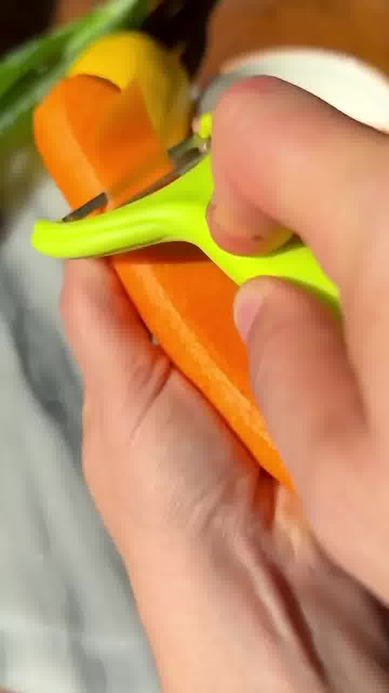
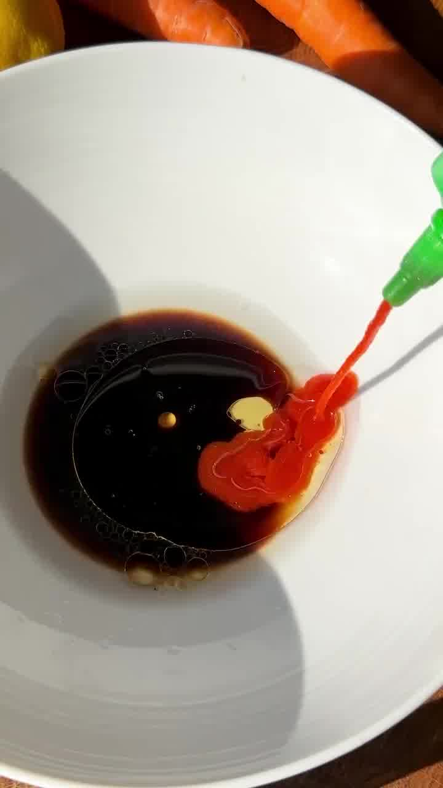
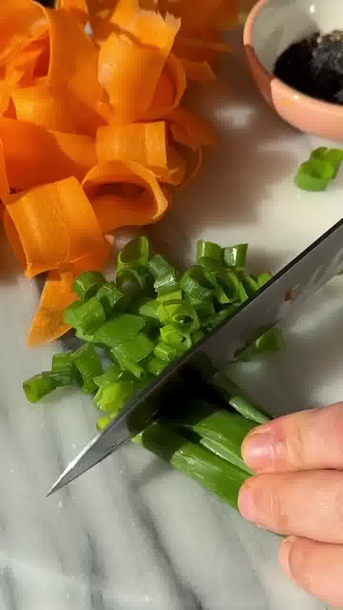
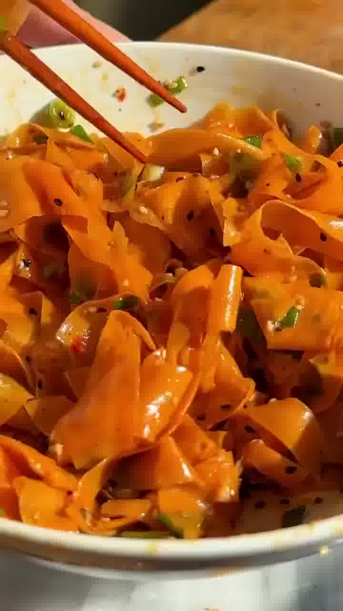

Super knackiger Karottensalat mit einem würzig-scharfen Sesam-Soja-Dressing. In 15 Minuten fertig und ideal zum Vorbereiten.

## Zubereitung

1. **Karotten:** Die Karotten schälen und mit einem Sparschäler längs in feine Streifen schneiden.

   

2. **Dressing:** Die halbe Zitrone auspressen und mit Sesamöl, Sojasauce, Sriracha, Agavensirup, Salz, Pfeffer und Chiliflocken zu einem Dressing verrühren.

   

3. **Frühlingszwiebeln:** Die Frühlingszwiebeln in feine Ringe schneiden.

   

4. **Vermischen:** Zum Schluss Karotten, Frühlingszwiebeln und Sesam zum Dressing geben und alles gut vermischen.

   

## Notizen & Varianten

- Quelle: Instagram-Reel von **Ana Negoita** (essen_paradies) — „Asiatischer Karottensalat". Titelbild und Schritt-Fotos aus dem Video.
