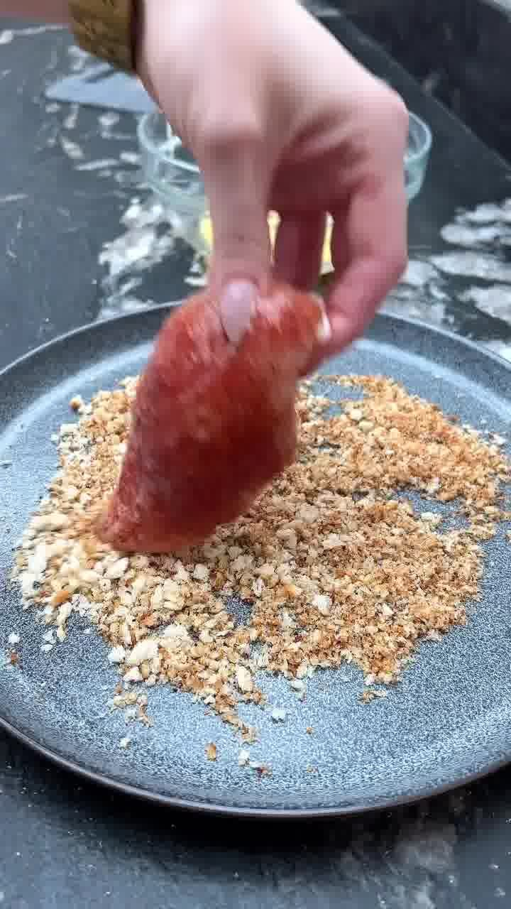
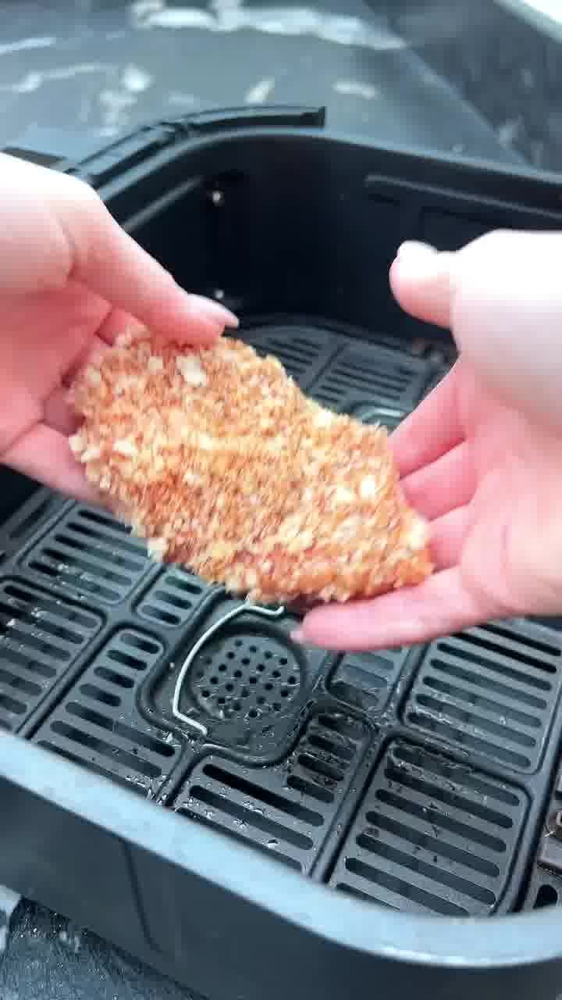

Knusprige Hähnchenbrust in Knoblauch-Panko, dazu Bang-Bang-Sauce, geschmolzener Käse und Eisbergsalat im Briochebrötchen. Schnelles, proteinreiches Sandwich mit nur 474 kcal pro Portion.

## Zubereitung

1. **Knoblauch-Panko rösten:** Butter und gehackten Knoblauch in eine Pfanne geben. Sobald die Butter geschmolzen ist, die Panko-Semmelbrösel zugeben und ca. **5 Minuten** rösten, bis sie goldbraun werden. Vom Herd nehmen.

   

2. **Hähnchen würzen:** Die Hähnchenbrüste rundum mit geräuchertem Paprikapulver, Knoblauchgranulat, Salz und Pfeffer würzen.

   

3. **Panieren:** Jede Hähnchenbrust in das verquirlte Ei tauchen, überschüssiges Ei abtropfen lassen, dann in den gerösteten Bröseln wälzen und gut andrücken.

   

   

4. **Garen:** Im Airfryer **17 Minuten bei 180 °C** garen. Alternativ im Ofen **20 Minuten bei 180 °C** backen.

   

5. **Bang-Bang-Sauce:** Währenddessen Mayonnaise, Sweet-Chili-Sauce und Sriracha verrühren und beiseitestellen.

   

6. **Käse schmelzen:** Die Briochebrötchen leicht toasten. Ist das Hähnchen fertig, je eine Käsescheibe auf den Brötchenboden legen und für eine Minute zurück in den Airfryer, damit der Käse schmilzt.

   

7. **Belegen:** Mit dem Hähnchen, Bang-Bang-Sauce, Chiliflocken und Eisbergsalat belegen und den Brötchendeckel aufsetzen.

## Notizen & Varianten

- **Makros pro Sandwich:** 474 kcal, 43 g Protein, 12,5 g Fett, 45 g Kohlenhydrate.
- Quelle: Instagram-Reel von **alexskitchenbangers** (Alex Hughes) — „Crispy Garlic Crumbed Bang Bang Chicken Sandwiches". Titelbild und Schritt-Fotos aus dem Video.
