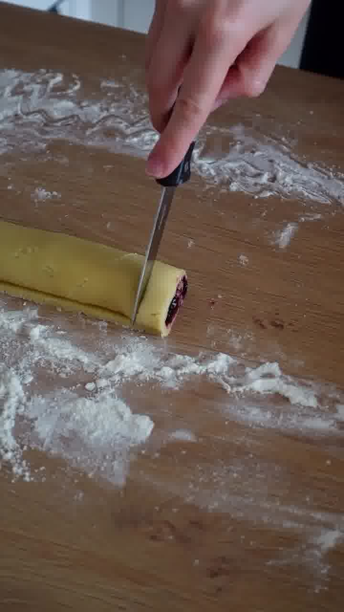

Zarte Mürbeteig-Plätzchen mit Blaubeer-Vanille-Füllung — aufgerollt, in Stücke geschnitten und mit Puderzucker bestäubt. Sorte 11/30 aus der Weihnachtsbäckerei.

## Zubereitung

1. **Teig kneten:** Mehl, Zucker, Vanillezucker, Butter, Eigelb, Vanillearoma und Butter-Vanille-Aroma zu einem glatten Mürbeteig verkneten.

   

2. **Ausrollen:** Den Teig auf einer bemehlten Fläche rechteckig und dünn ausrollen.

   

3. **Füllen:** Die Blaubeermarmelade gleichmäßig auf dem Teig verstreichen.

   

4. **Aufrollen:** Den Teig von der langen Seite her fest aufrollen.

   

5. **Schneiden:** Die Rolle in ca. 2 cm breite Stücke schneiden und auf ein mit Backpapier belegtes Blech setzen.

   

6. **Backen:** Bei **160 °C Umluft ca. 10–12 Minuten** backen.

7. **Bestäuben:** Auskühlen lassen und großzügig mit Puderzucker bestäuben.

## Notizen & Varianten

- Quelle: Instagram-Reel von **lisinnfluencer** (Lisi) — „Meine Sorte 11/30: Vanille-Blaubeer Traumstücke". Titelbild und Schritt-Fotos aus dem Video.
- **Portionen (30) = ungefähre Stückzahl.** Aus einer Teigrolle ergeben sich je nach Schnittbreite ca. 25–35 Stück; Mengen über den Portionsrechner anpassbar.
- **Schneiden/Blech** sind im Original nicht wörtlich erklärt, ergeben sich aber aus dem Video (Rolle wird geschnitten und aufs Blech gesetzt).
