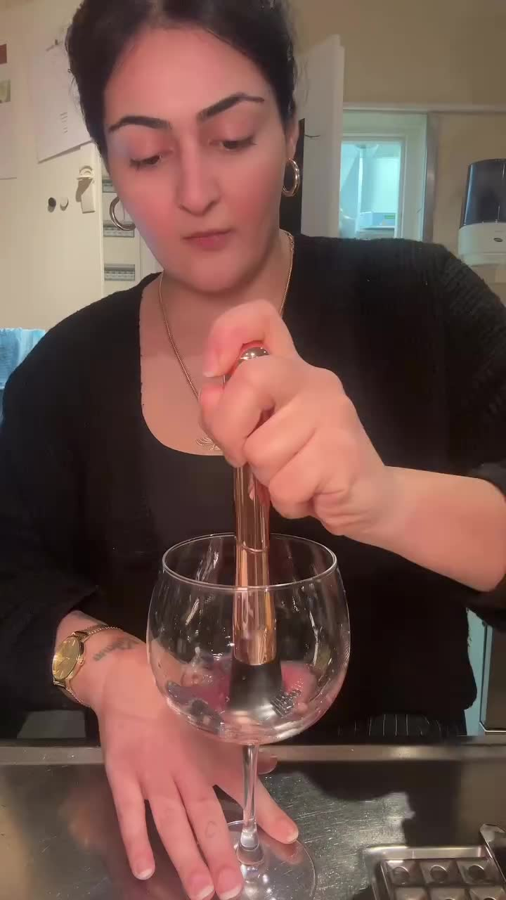
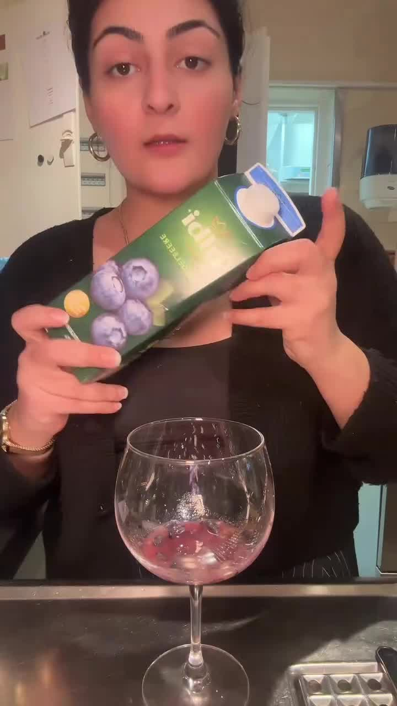
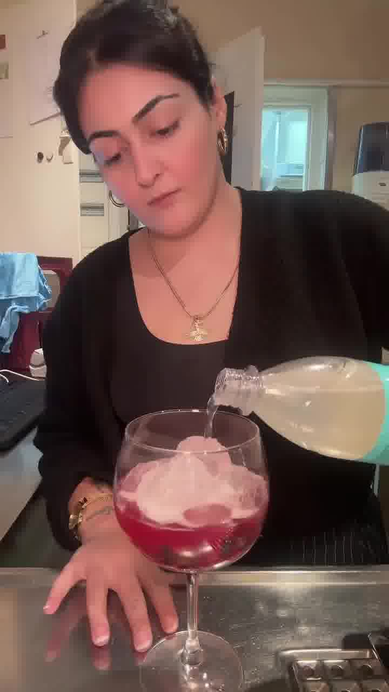

Fruchtig-frischer, alkoholfreier Spritz mit Blaubeere und Zitrone — super schnell gemacht und perfekt für Frühling und Sommer.

## Zubereitung

1. **Stampfen:** Zuerst frische Blaubeeren und den Zitronensaft ins Glas geben und leicht stampfen — das bringt mehr Geschmack.

   

2. **Blaubeersaft:** 6 cl Blaubeersaft dazugeben.

   

3. **Auffüllen:** Mit Eiswürfeln auffüllen und den Rest mit Bitter Lemon aufgießen.

   

4. **Servieren:** Kurz umrühren und nach Belieben mit ein paar frischen (oder gefrorenen) Blaubeeren, einer Zitronenscheibe und Minze dekorieren.

## Notizen & Varianten

- Quelle: Instagram-Reel von **Kimi** (erfolgsserum) — „Blaubeer-Zitronen-Spritz". Titelbild und Schritt-Fotos aus dem Video.
- Gefrorene Beeren als Deko kühlen den Drink zusätzlich.
