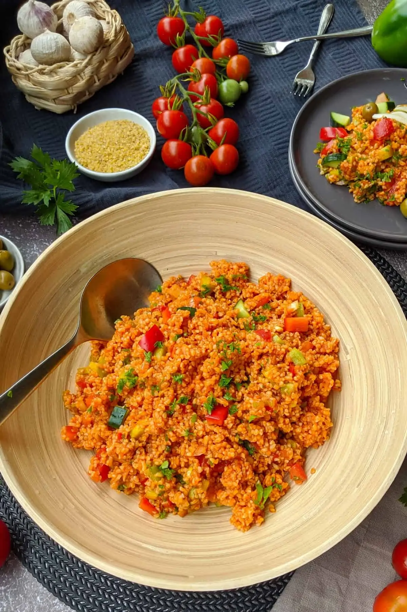

Türkisch geprägter Bulgursalat mit viel Ajvar, Granatapfelmelasse und Zitrone.
Das Gemüse kommt bewusst doppelt vor: **fein gehackt**, damit eine einheitliche
Masse entsteht, und in **groben Chunks** für Optik und Biss.

## Zubereitung

1. **Bulgur kochen.** Reichlich Wasser in einem großen Topf aufsetzen, 2–3 Prisen gekörnte
   Rinderbrühe hineingeben. Den groben Bulgur darin weich kochen — **ca. 15–20
   Minuten**, die Packungsangabe ist der Startpunkt. Maßgeblich ist die
   Konsistenz: weich, aber nicht matschig. Überschüssiges Wasser abgießen und
   den Bulgur auf **lauwarm** abkühlen lassen.
2. **Fein hacken.** Eine **halbe** Paprika, 2–3 Tomaten und die rote Zwiebel
   sehr fein hacken. Die Tomaten werden **nicht** entkernt.
3. **Chunks schneiden.** Die **andere Hälfte** der Paprika und 1–2 weitere
   Tomaten in grobe Stücke schneiden. Diese separat beiseitestellen — sie
   kommen erst am Ende dazu.
4. **Dressing anrühren.** Ajvar, Tomatenmark, Olivenöl, Zitronensaft und
   Granatapfelmelasse in einer großen Schüssel verrühren, mit Salz, Pfeffer und
   Fondor würzen. Das fein gehackte Gemüse untermengen.
5. **Zusammenführen.** Den lauwarmen Bulgur und die Gemüse-Chunks in die
   Schüssel geben und alles gründlich durchmischen. Abschmecken.
6. **Ziehen lassen.** Den Salat **ca. 30 Minuten** durchziehen lassen. Vor dem
   Servieren nach Belieben mit etwas Petersilie bestreuen.

## Notizen & Varianten

- **Dazu:** klassisch zu Ćevapčići, ansonsten als Beilagensalat zu allem vom
  Grill.
- **Hält sich 3–4 Tage** im Kühlschrank, abgedeckt. Am nächsten Tag ist er
  genauso gut oder besser — lässt sich also gut vorbereiten.
- **Granatapfelmelasse** (türkisch *nar ekşisi*) ist eingekochter
  Granatapfelsaft: dunkel, sirupartig, süß-sauer. Nicht zu verwechseln mit
  Granatapfelnektar oder -saft — die sind dünn und liefern die Säure nicht.
- **Fondor** ist ein Würzsalz mit Hefeextrakt. Ersatzweise Salz plus etwas
  Gemüsebrühpulver.
- Der Salat ist mit dem lauwarmen Bulgur angesetzt, weil der die Sauce besser
  aufnimmt als ausgekühlter.
- Verwandt mit dem türkischen **Kısır**, weicht aber bewusst ab: keine
  Petersilie oder Minze im Salat, dafür deutlich mehr Ajvar.
