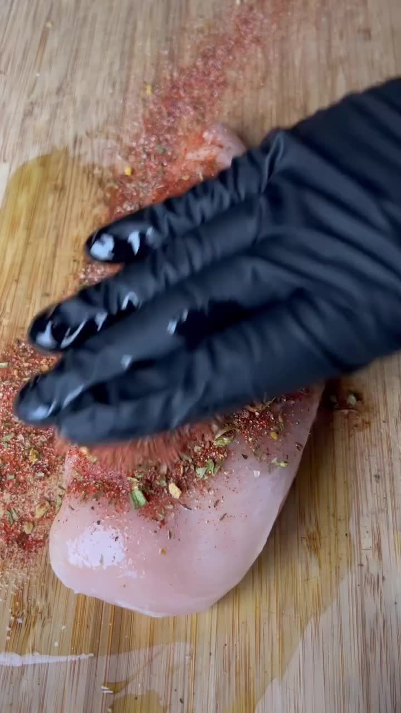
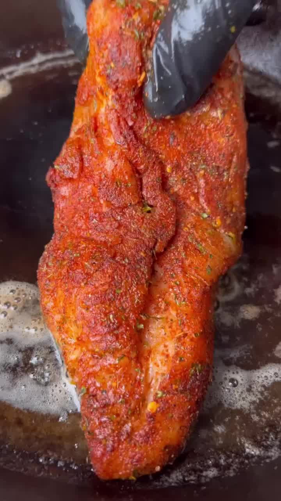
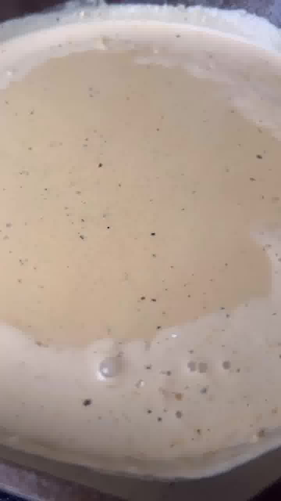
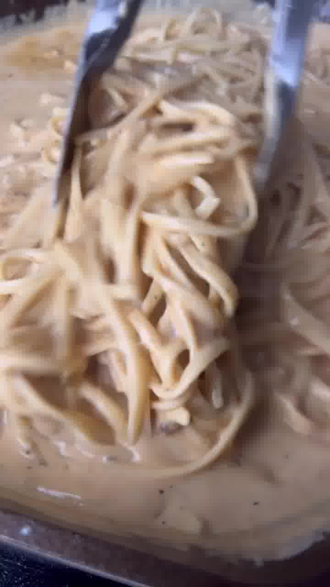
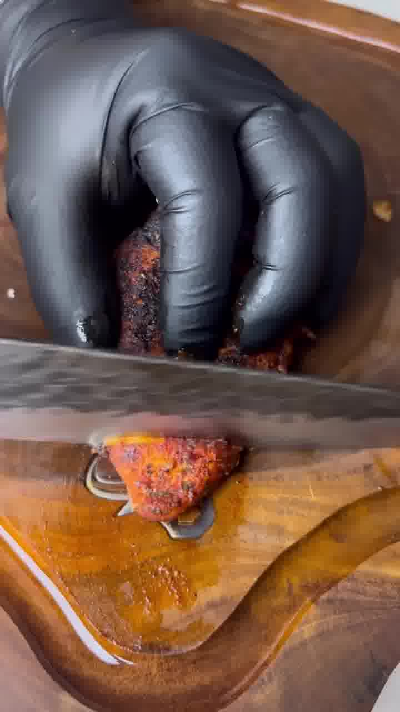

Cremige Alfredo-Pasta mit kräftig gewürztem Cajun-Hähnchen — ein Familien-Liebling und in gut 20 Minuten fertig.

## Zubereitung

1. **Hähnchen würzen:** Geräuchertes Paprikapulver, Knoblauch- und Zwiebelpulver, Salz, Pfeffer, Cayennepfeffer und die Kräutermischung mischen und die Hähnchenbrüste rundum damit einreiben (vorher mit etwas Öl bestreichen, damit die Gewürze haften).

   

2. **Anbraten:** In einer Pfanne bei mittlerer bis hoher Hitze anbraten, pro Seite ca. **3 Minuten**, bis das Hähnchen innen **74 °C** erreicht hat. Herausnehmen und beiseitelegen.

   

3. **Knoblauchbutter:** In dieselbe Pfanne die Butter und den fein gehackten Knoblauch geben und kurz andünsten.

4. **Sauce:** Hühnerbrühe, Sahne, Speisestärke und den geriebenen Parmesan zugeben und unter Rühren einköcheln lassen, bis die Sauce cremig andickt.

   

5. **Nudeln:** Die gekochten Bandnudeln in die Sauce geben und darin schwenken.

   

6. **Anrichten:** Das Hähnchen in Scheiben schneiden, auf die Pasta legen und mit frischer Petersilie bestreuen.

   

## Notizen & Varianten

- Quelle: Instagram-Reel von **Nick Nesgoda** (burnt_pellet_bbq) — „Easy 20 minute Cajun Chicken Alfredo". Titelbild und Schritt-Fotos aus dem Video.
- **Mengen:** Für das Hähnchen nennt das Reel keine genaue Menge — 2 Hähnchenbrüste sind eine sinnvolle Annahme für 4 Portionen. Die Gewürzmengen (je 2 EL) sind großzügig; nach Geschmack anpassen.
- Original: 1 EL „garlic herb blend" — hier als Kräutermischung mit Knoblauch übersetzt.
