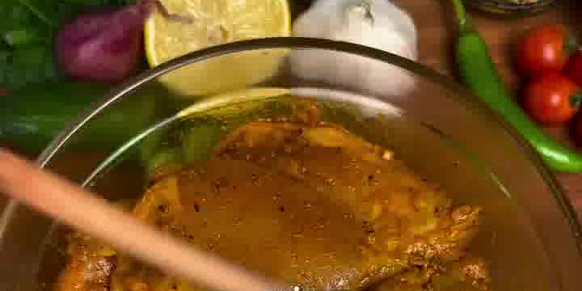
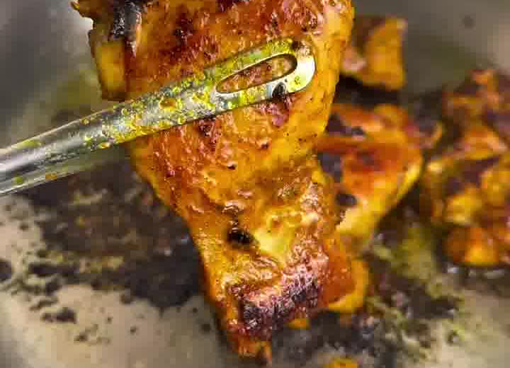
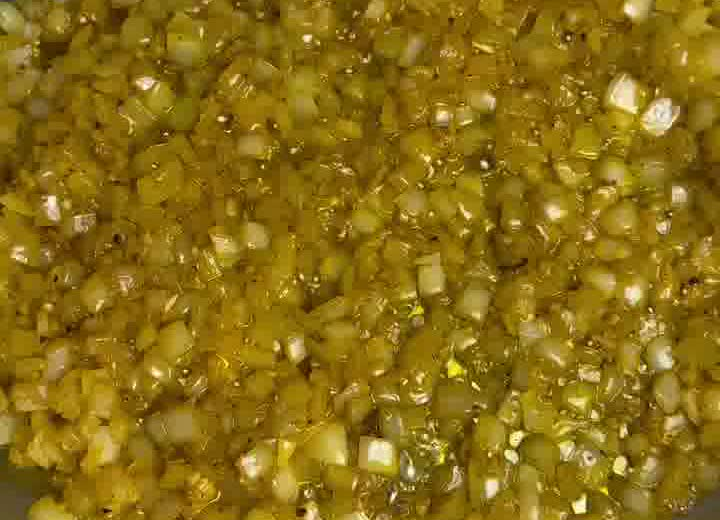
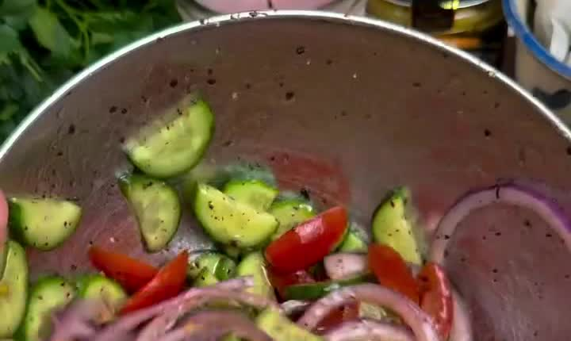
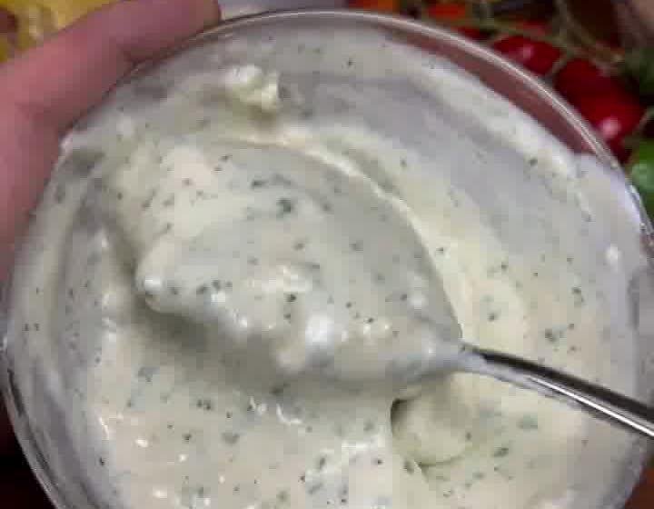

One-Pan-Feierabendessen im Shawarma-Stil: würzig mariniertes Hähnchen, goldener Zwiebel-Reis-Pilaw, ein frischer Sumak-Salat und eine cremige Knoblauchsauce — alles aus einer Pfanne. „Dinners you'll actually make", Folge 38.

## Zubereitung

1. **Hähnchen marinieren:** Das Hähnchen in einer Schüssel mit den Gewürzen (Paprikapulver, Kreuzkümmel, Zwiebelpulver, Koriander, Piment, Kurkuma, Pfeffer, Salz), Olivenöl, Knoblauch, Zitronensaft und Hühnerbrühpulver vermengen. Gut mischen und marinieren, so lange die Geduld reicht (mindestens 30 Minuten, gern länger).

   

2. **Hähnchen anbraten:** Eine große Pfanne bei mittlerer bis hoher Hitze erhitzen und etwas Olivenöl hineingeben. Das Hähnchen **portionsweise** einlegen und je Seite **6–8 Minuten** goldbraun und durchgaren. Herausnehmen und beiseitestellen.

   

3. **Zwiebel-Reis (in derselben Pfanne):** Hitze auf mittel-niedrig reduzieren. Butter in die Pfanne geben, dann die Zwiebeln unter häufigem Rühren glasig dünsten. Knoblauch und Gewürze (Kurkuma, Paprikapulver, Knoblauchpulver, Pfeffer) zugeben und **1–2 Minuten** mitrösten. Den Reis zugeben und **2 Minuten** unter Rühren anrösten. Die heiße Hühnerbrühe angießen, umrühren und aufkochen. Sobald es kocht, zudecken, Hitze auf niedrig stellen und **20 Minuten** köcheln lassen, bis der Reis gar ist.

   

4. **Sumak-Salat:** Rote Zwiebel, Kirschtomaten und Gurke mit Salz, Pfeffer, Sumak und Zitronensaft in einer Schüssel vermengen.

   

5. **Knoblauchsauce:** Mayonnaise, griechischen Joghurt, Knoblauch, Petersilie, Salz, Pfeffer, Zitronensaft und Olivenöl in einer Schüssel glatt verrühren.

   

6. **Anrichten:** Den Zwiebel-Reis in Schüsseln geben, das Hähnchen daraufsetzen und mit Sumak-Salat und Knoblauchsauce servieren. Genießen!

## Notizen & Varianten

- Quelle: Instagram-Reel von **@recipeincaption** („dinners you'll actually make", Episode 38 — One-Pan Chicken Shawarma Rice Bowls).
- Das „Hühnerbrühpulver" ist im Original *Better Than Bouillon* (Hühnerpaste) — jede konzentrierte Hühnerbrühe funktioniert; die Brühe für den Reis kannst du daraus mit heißem Wasser anrühren.
- **Portionen (4) geschätzt** — passt als sättigendes Abendessen für 4 Personen; bei größerem Hunger eher 3.
- Mengen aus US-Einheiten umgerechnet (1 Tasse Reis ≈ 200 g, 1 Tasse Zwiebeln ≈ 150 g) — bei Bedarf anpassen.
