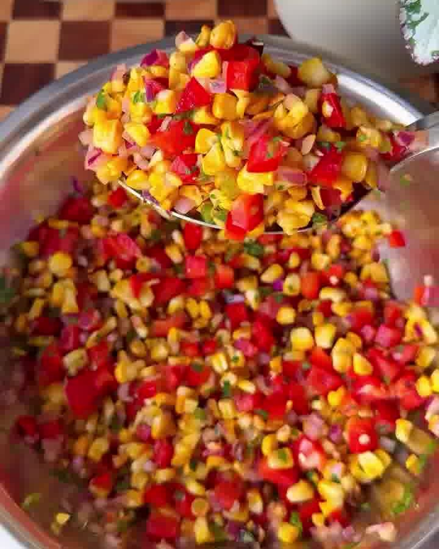

Saftige Hähnchenschenkel in einer klebrig-rauchigen Chipotle-Limetten-Marinade, dazu ein gerösteter Street-Corn-Salat, cremige Guacamole und Limetten-Koriander-Reis. High-Protein, voller Geschmack und perfekt zum Vorbereiten (ca. 560 kcal, 39 g Eiweiß pro Portion).

## Zubereitung

1. **Hähnchen marinieren:** Chipotle in Adobo, Taco-Gewürz, Knoblauchpulver, Honig, Limettensaft, Limettenschale und Salz in einer Schüssel verrühren. Die Hähnchenschenkelfilets darin wenden, bis sie rundum bedeckt sind. Mindestens **30 Minuten** marinieren.

2. **Maissalat rösten:** Die Maiskolben leicht mit Olivenöl (oder Ölspray) einsprühen und mit dem Taco-Gewürz würzen. In einer großen Pfanne bei mittel-hoher Hitze unter gelegentlichem Wenden **8–12 Minuten** rösten, bis sie zart und leicht verkohlt sind. Etwas abkühlen lassen, die Körner vom Kolben schneiden und mit Paprika, roter Zwiebel, Koriander, Jalapeño, Limettensaft und Salz mischen. Abschmecken.

   

3. **Hähnchen garen:** Den Airfryer 5 Minuten auf **200 °C** vorheizen. Das Hähnchen in einer Lage **7–8 Minuten** garen, wenden und weitere **5–6 Minuten**, bis es durch ist. 5 Minuten ruhen lassen, dann in Scheiben schneiden.

4. **Guacamole:** Die Avocado zerdrücken, bis sie überwiegend glatt ist. Tomate, Zwiebel, Koriander, Knoblauchpulver, Limettensaft und Salz unterheben. Abschmecken.

5. **Reis:** Den gekochten Reis mit dem gehackten Koriander und der Limettenschale vermengen.

6. **Anrichten:** Den Reis auf vier Bowls verteilen. Mit dem geschnittenen Hähnchen, dem Maissalat und der Guacamole belegen. Mit eingelegten Zwiebeln und frischem Koriander garnieren.

## Notizen & Varianten

- Quelle: Instagram-Reel von **Lulu Dowell** (fit_foodie_lulu) — „Sticky Chipotle Lime Chicken Rice Bowl". Zutaten und Ablauf vollständig aus der Caption (für 4 Portionen), Titel- und Schrittbild aus dem Video.
- Ohne Airfryer: Das marinierte Hähnchen in einer heißen Grill- oder Bratpfanne bzw. im Ofen bei 200 °C Ober-/Unterhitze garen, bis es durch ist und schön Farbe hat.
- Die Marinade lebt vom Chipotle in Adobo (rauchig-scharf) — Menge nach Schärfevorliebe anpassen.
