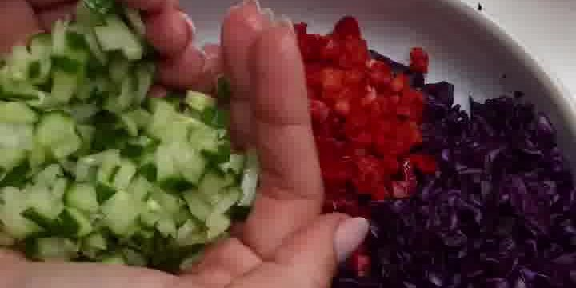
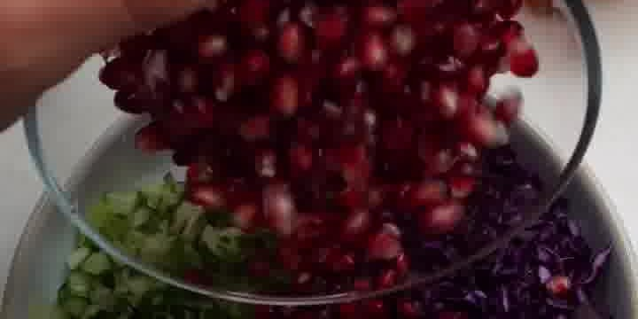
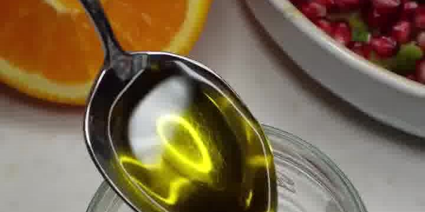
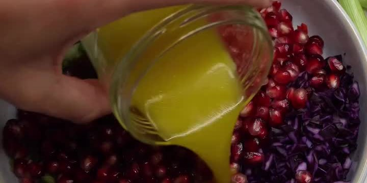

Ein knackiger „Chop-Chop"-Regenbogensalat: alles fein gehackt, mit süßen Granatapfelkernen und einem frischen Orangen-Olivenöl-Dressing. Farbenfroh, vegan und ganz ohne Kochen. Von **ariane ernst**.

## Zubereitung

1. **Gemüse fein hacken:** Rotkohl, rote Spitzpaprika, Gurke und Staudensellerie jeweils fein würfeln bzw. hacken und in eine große Schüssel geben.

   

2. **Kräuter & Granatapfel:** Petersilie (oder Koriander) fein hacken und zugeben. Den Granatapfel entkernen und die Kerne über den Salat geben.

   

3. **Dressing:** Für das Dressing den Saft einer Orange mit Olivenöl (und einer Prise Salz) in einem Glas verrühren bzw. schütteln.

   

4. **Anmachen:** Das Dressing über den Salat geben und alles gut durchmischen. Sofort servieren.

   

## Notizen & Varianten

- Quelle: Instagram-Reel von **arianeernstjewelry** (ariane ernst) — „chop chop salad". Das Reel hatte **keinen Rezepttext**; Zutaten, Schritte und Bilder sind aus dem Video abgeleitet.
- **Mengen geschätzt:** Im Video sind keine Mengenangaben zu sehen. Die Zutaten (Rotkohl, rote Spitzpaprika, Gurke, Staudensellerie, Kräuter, Granatapfel, Orangensaft, Olivenöl) sind aber alle klar erkennbar — die angegebenen Mengen sind ein plausibler Richtwert für eine große Schüssel und nach Geschmack anzupassen.
- **Kräuter unsicher:** Das fein gehackte Grün könnte glatte **Petersilie** oder **Koriander** sein — beides passt.
- Im Hintergrund liegen Frühlingszwiebeln; ob sie in den Salat kommen, ist im Video nicht eindeutig — nach Belieben zusätzlich fein geschnitten untermischen.
