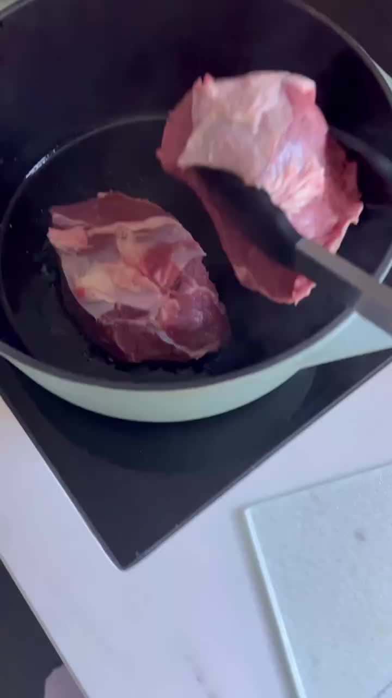
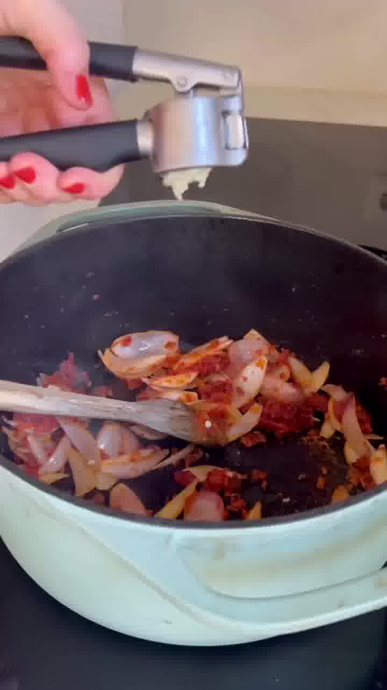
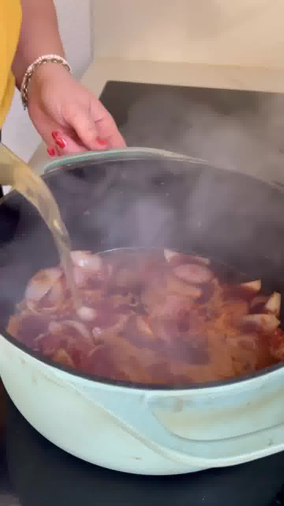
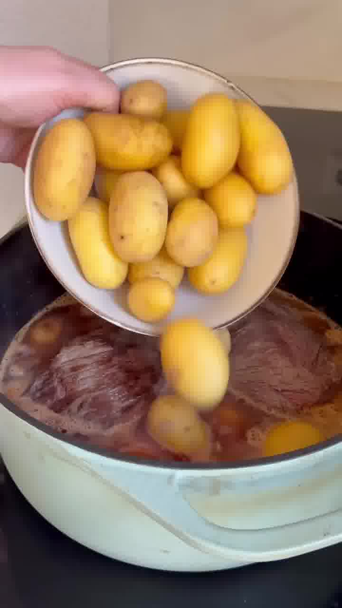
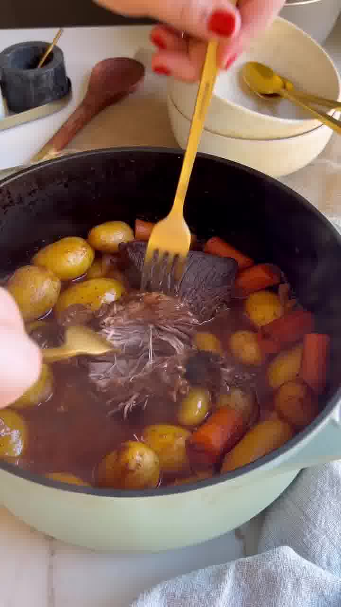

Ein gelingsicherer Schmorbraten für Gäste: schnell vorbereitet, dann erledigt der Ofen in 2,5–3 Stunden den Rest. Fleisch, Kartoffeln und Karotten schmoren gemeinsam in einer aromatischen Sauce.

## Zubereitung

1. **Anbraten:** 1 EL Ghee in einem Schmortopf erhitzen. Das Rindfleisch mit 1 EL Salz würzen und rundherum kräftig anbraten.

   

2. **Gemüse vorbereiten:** Währenddessen Karotten und Zwiebeln schälen und in grobe Stücke schneiden.

3. **Anrösten:** Das Fleisch herausnehmen. Die Zwiebeln mit dem restlichen 1 EL Ghee, dem Tomatenmark und dem Mehl anrösten. Den Knoblauch (gepresst oder gehackt) zugeben und kurz mitrösten.

   

4. **Ablöschen:** Mit Traubensaft und Rinderbrühe ablöschen.

   

5. **Alles in den Topf:** Das Fleisch zurücklegen, die Kartoffeln und Karotten zusammen mit den Lorbeerblättern und etwas Pfeffer dazugeben.

   

6. **Schmoren:** Abgedeckt bei **160 °C Umluft** für **2,5–3 Stunden** in den Ofen geben.

7. **Servieren:** Das Fleisch mit zwei Gabeln zerzupfen, alles vorsichtig vermengen und servieren.

   

## Notizen & Varianten

- Quelle: Instagram-Reel von **Sarah Buckenberger** (eatwithsarah_) — „Einfacher Schmorbraten". Titelbild und Schritt-Fotos aus dem Video.
- **Traubensaft oder Rotwein:** Im Video wird mit Traubensaft abgelöscht (weil Kinder mitessen). Rotwein geht genauso.
- Nicht verwechseln mit dem [zarten Rinderbraten aus dem Ofen](zarter-rinderbraten.md) — das ist ein anderes Rezept mit Rotwein-Gemüsesauce und Tafelspitz.
