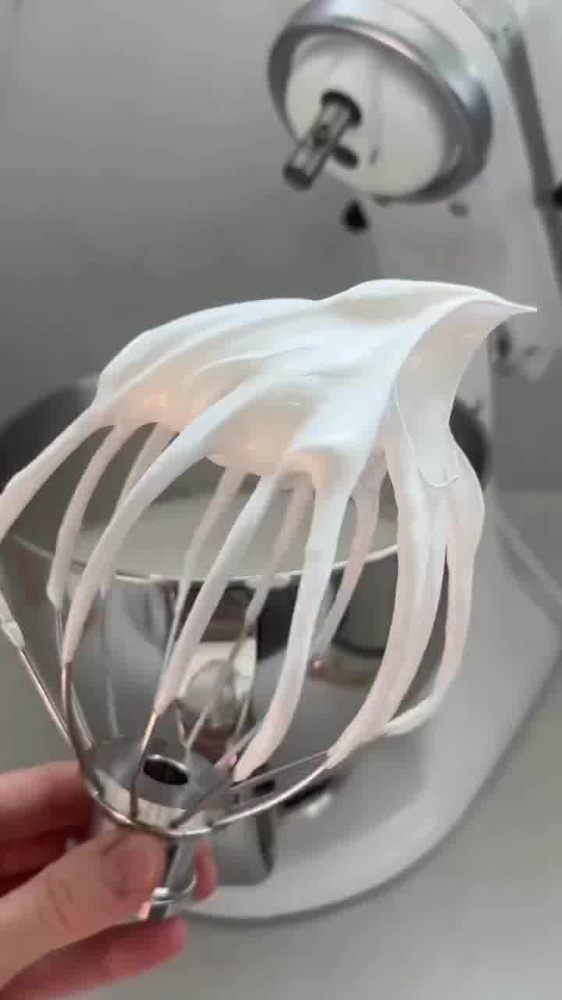
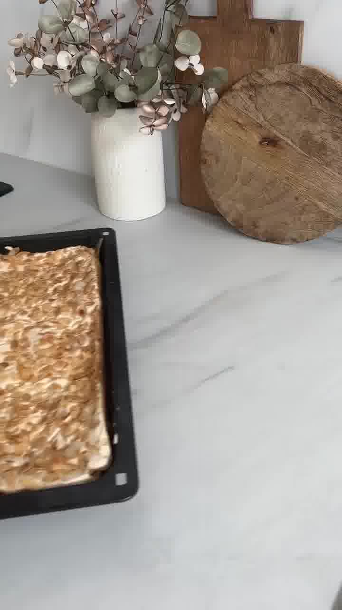
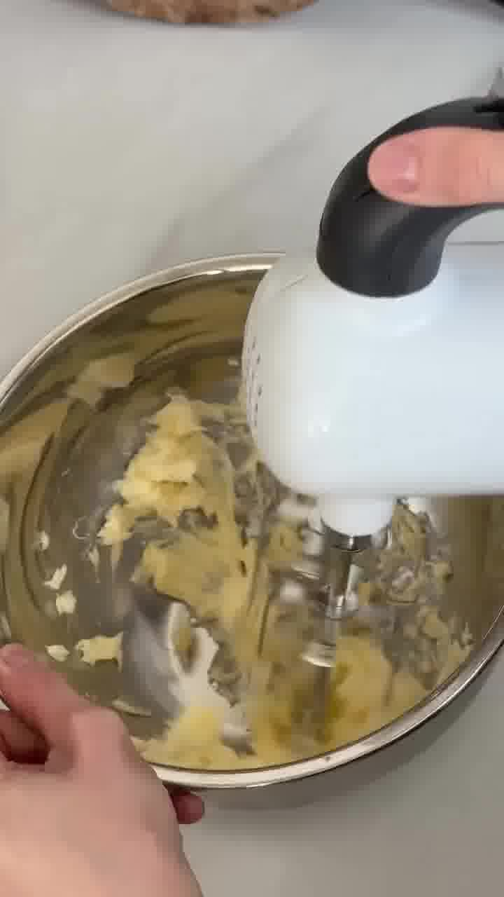
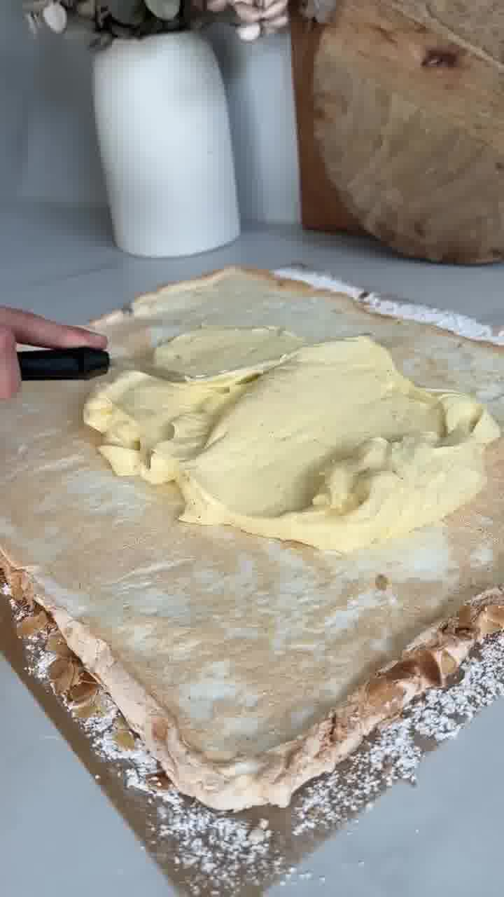

Eine luftige Baiser-Rolle mit Mandeln, gefüllt mit Vanille- und Sahnecreme und frischen Erdbeeren — das perfekte, leichte Sommerdessert für die Gartenparty.

## Zubereitung

1. **Pudding vorkochen:** Den Vanillepudding nach Packungsanleitung kochen (dabei auf die Milchmenge achten — hier 500 ml). Nach dem Kochen den Bourbon-Vanillezucker unterheben, mit Frischhaltefolie abdecken und komplett abkühlen lassen.

2. **Eiweißmasse:** Den Backofen auf **160 °C Umluft** vorheizen. Das Eiweiß mit dem Zucker aufschlagen. Wenn der Zucker sich aufgelöst hat, das Salz zugeben und weiterschlagen, bis eine feste Masse entsteht.

   

3. **Unterrühren:** Speisestärke und Apfelessig zugeben und noch einmal kurz umrühren.

4. **Backen:** Die Masse gleichmäßig auf einem mit Backpapier belegten Blech verteilen und mit den Mandeln bestreuen. **20 Minuten** backen.

   

5. **Stürzen:** Auf ein anderes Stück Backpapier Puderzucker sieben und die fertig gebackene Eiweißmasse darauf stürzen. Abkühlen lassen.

6. **Sahnecreme:** Sahne, Puderzucker und San Apart steif aufschlagen.

7. **Vanillecreme:** Die Butter aufschlagen, bis sie sich verdoppelt hat, dann nach und nach den Vanillepudding unterheben und cremig schlagen.

   

8. **Erdbeeren:** Die Erdbeeren waschen, gut abtrocknen und in grobe Würfel schneiden.

9. **Schichten & rollen:** Auf den Boden zuerst die Vanillecreme, dann die Sahnecreme und darauf die Erdbeeren geben (nicht zu viele, sonst lässt sich die Rolle nicht zurollen). Mithilfe des Backpapiers vorsichtig aufrollen. Zur Deko etwas Sahne mit Puderzucker aufschlagen, aufspritzen und mit Erdbeeren garnieren.

   

   

10. **Kühlen:** Vor dem Servieren am besten **3–4 Stunden** kaltstellen.

## Notizen & Varianten

- Quelle: Instagram-Reel von **Naemy Klassen** (naemyklassen_) — „Erdbeerwolke" (Original-Rezept: foodblogicukarisol). Titelbild und Schritt-Fotos aus dem Video.
- **San Apart** stabilisiert die Sahne — ersatzweise Sahnesteif.
