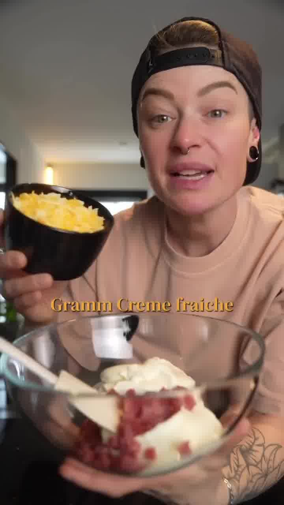
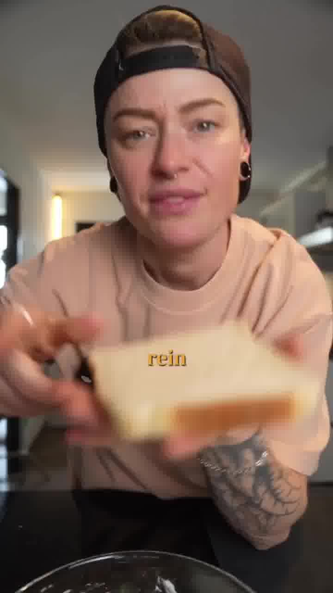
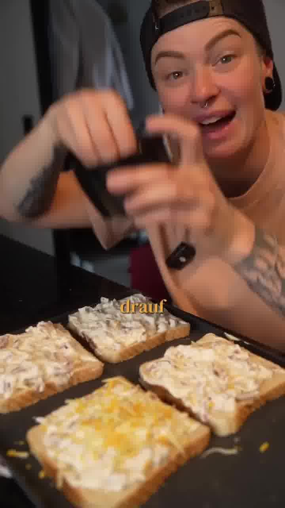

Flammkuchen-Gefühl in unter 5 Minuten Zubereitung: cremig belegte, überbackene Toasts mit Schmand, Schinken und Käse. Perfekt als Snack, schnelles Abendessen oder Partyfood.

## Zubereitung

1. **Creme anrühren:** Schmand mit Frischkäse (oder Crème fraîche) in einer Schüssel glatt rühren.

   

2. **Füllen & würzen:** Schinkenwürfel und eine Handvoll geriebenen Käse unter die Creme mischen. Mit Steaksalz würzen. *(Alternativ groben Pfeffer, Salz, Rosmarin, etwas Thymian und Knoblauch.)*

   

3. **Bestreichen:** Die Creme großzügig auf die Toastscheiben streichen.

   

4. **Toppen:** Noch einmal geriebenen Käse über die belegten Toasts streuen. Nach Belieben mit dünnen roten Zwiebelringen belegen (wie im Video).

   

5. **Backen:** Im vorgeheizten Ofen bei **200 °C (Ober-/Unterhitze) ca. 10–15 Minuten** backen, bis die Oberfläche schön goldbraun ist.

## Notizen & Varianten

- Quelle: Instagram-Reel von **nicolnic90** (Nicol) — „Flammkuchentoast", eines ihrer Lieblingsrezepte. Titelbild und Schritt-Fotos aus dem Video.
- **Rote Zwiebelringe** stehen nicht in der Zutatenliste des Originals, werden im Video aber deutlich mit auf die Toasts gelegt — daher als optionale Zutat ergänzt.
- Schmeckt heiß am besten.
