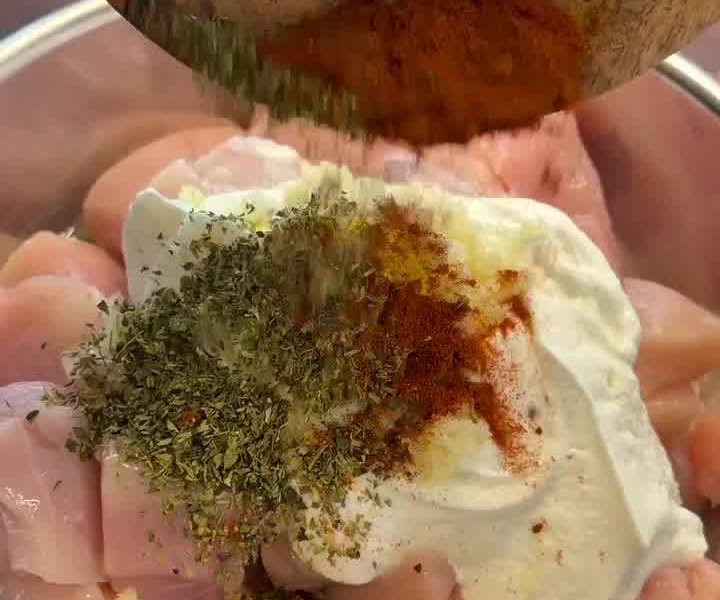
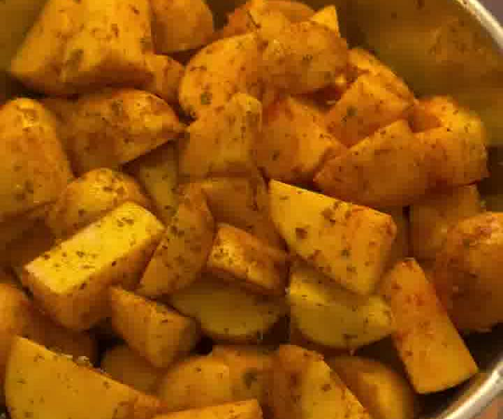
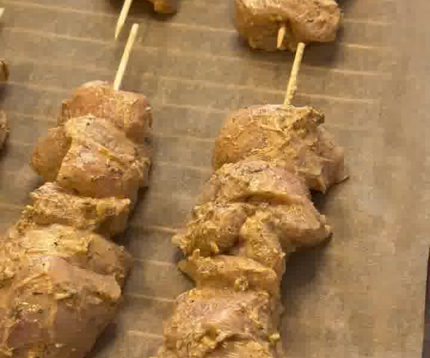
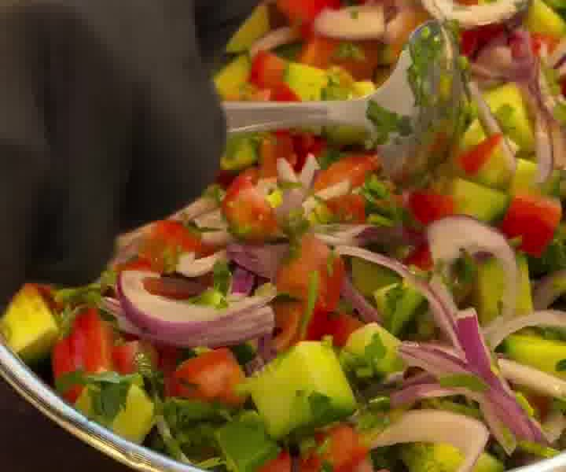
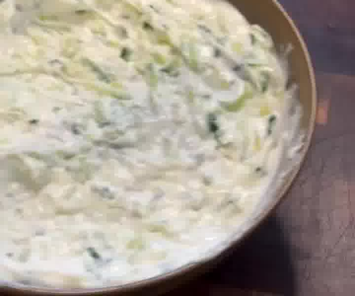

High-Protein-Bowl im Gyros-Stil: mariniertes Hähnchen, würzige Airfryer-Kartoffeln, frischer griechischer Salat und Tzatziki. **Ca. 550 kcal & 64 g Protein pro Portion** — sättigend und ideal fürs Meal-Prep.

## Zubereitung

1. **Hähnchen marinieren:** Hähnchenbrust mit Joghurt, Zitronensaft, Olivenöl und den Gewürzen (Knoblauch, Oregano, Paprikapulver, Salz, Pfeffer) vermengen und **mindestens 30 Minuten** marinieren (gern länger).

   

2. **Kartoffeln:** Kartoffeln würfeln, mit den Gewürzen und etwas Olivenölspray vermischen und bei **180 °C ca. 30 Minuten im Airfryer** garen. Nach der Hälfte der Zeit einmal durchschütteln, anschließend mit Zitronensaft beträufeln.

   

3. **Hähnchen garen:** Im Ofen bei **200 °C ca. 20 Minuten** garen (im Reel als Spieße). Danach mit einer Mischung aus Sriracha und 1 TL Olivenöl bepinseln. *(Alternativ im Airfryer oder in der Pfanne.)*

   

4. **Griechischer Salat:** Gurke, Tomaten, rote Zwiebel und Petersilie klein schneiden und mit Zitronensaft und einer Prise Salz vermengen.

   

5. **Tzatziki:** Die geriebene Gurke gut ausdrücken und mit Joghurt, Knoblauch, Zitronensaft, Salz, Pfeffer und optional etwas Dill verrühren.

   

6. Alles zusammen anrichten und genießen.

## Notizen & Varianten

- **Makros:** ca. 550 kcal und 64 g Protein pro Portion (bei 4 Portionen) — High-Protein und meal-prep-tauglich.
- Quelle: Instagram-Reel von [@vincentbacher_](https://www.instagram.com/reel/DZnZVHsMdfP/) („POV: Du musst nie wieder Gyros essen gehen").
- Das Hähnchen ruhig länger marinieren, wenn Zeit ist — wird noch aromatischer.
