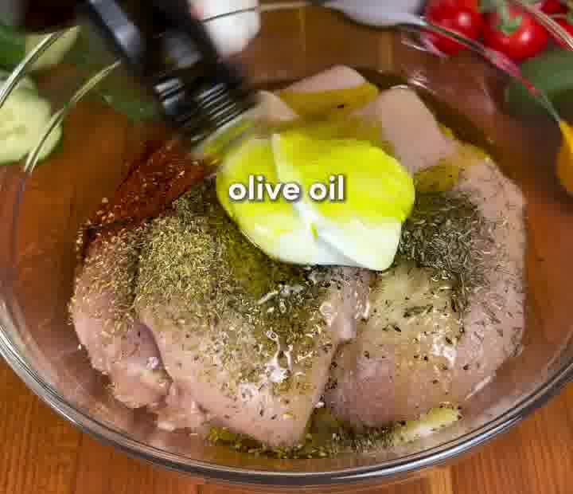
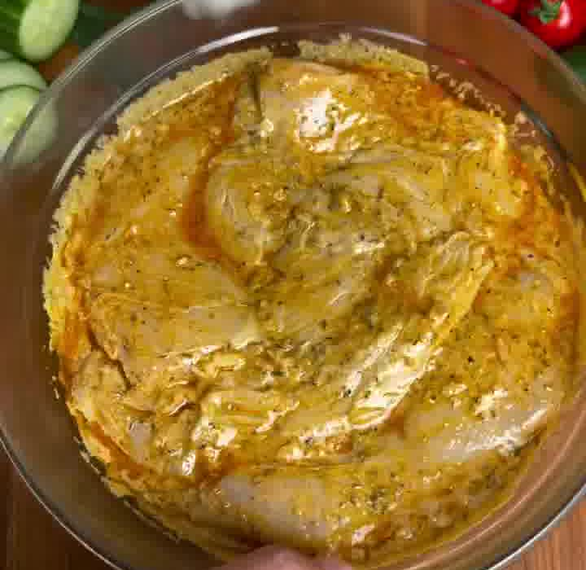
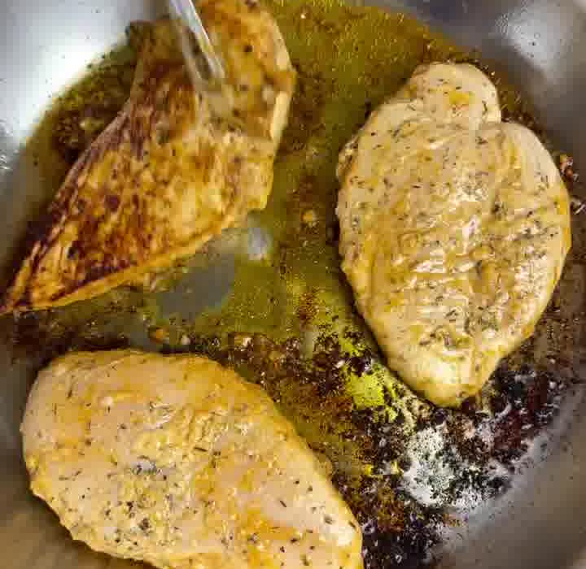
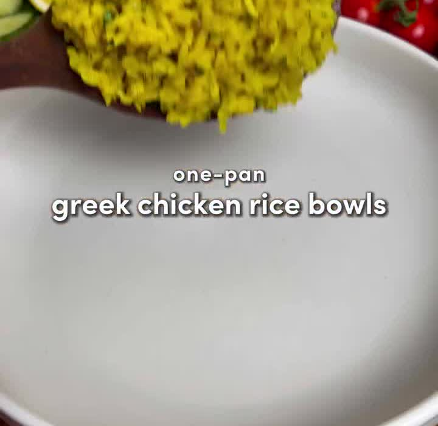
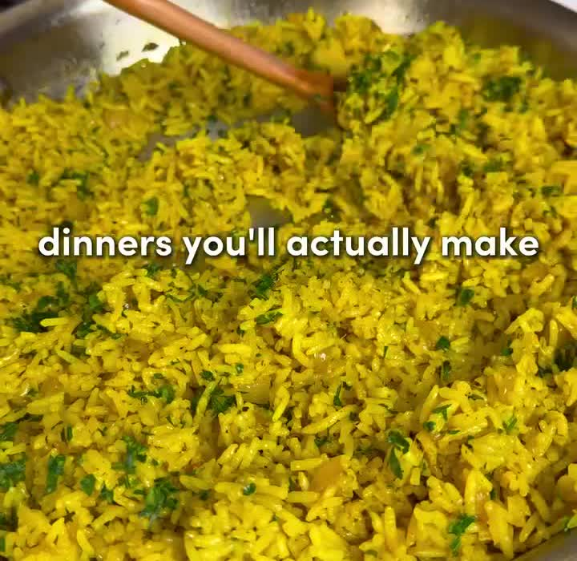
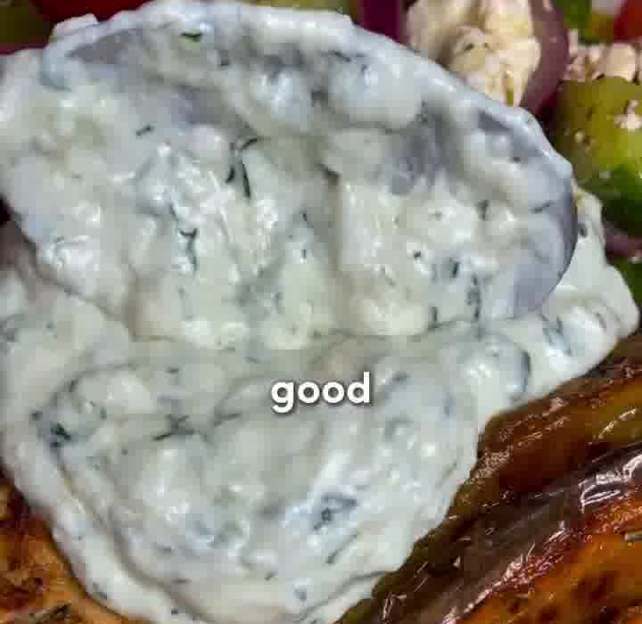
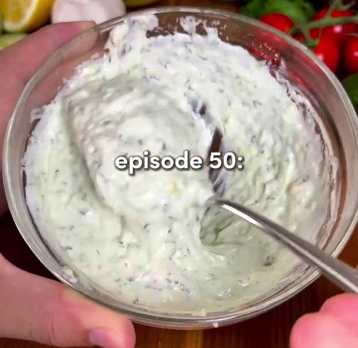

Alle frischen griechischen Aromen in einer Schüssel: saftige Hähnchenbrust aus der Pfanne auf Zitronen-Kräuter-Reis, dazu knackiger griechischer Salat und Tzatziki. Der Reis wird im selben Topf im Bratensatz des Hähnchens gekocht — daher „One-Pan".

## Zubereitung

1. **Hähnchen marinieren:** Die Hähnchenbrüste in eine große Schüssel geben. Griechischen Joghurt, Olivenöl, Paprikapulver, Knoblauchpulver, Oregano, Salz, Pfeffer, Thymian, den gehackten Knoblauch, die Hühnerbrüh-Paste und den Saft der halben Zitrone dazugeben.

   

2. **Durchmischen und ziehen lassen:** Alles gut vermengen, bis jedes Stück rundum überzogen ist. So lange marinieren lassen, „wie die Geduld reicht" — von sofort bis über Nacht im Kühlschrank.

   

3. **Hähnchen anbraten:** Eine große Pfanne bei mittlerer bis hoher Hitze erhitzen, Olivenöl hineingeben. Die Hähnchenbrüste **ca. 5–7 Minuten pro Seite** goldbraun und knusprig braten. Herausnehmen und ruhen lassen. Den Bratensatz in der Pfanne lassen.

   

4. **Zwiebel & Gewürze:** Hitze auf mittel-niedrig reduzieren. Butter und die gewürfelte Zwiebel in die Pfanne geben und weich dünsten. Knoblauch sowie Knoblauchpulver, Salz, Pfeffer und Kurkuma dazugeben und **1–2 Minuten** mitbraten.

   

5. **Reis anrösten und garen:** Den Reis dazugeben und **2 Minuten** anrösten. Das heiße Wasser mit der darin aufgelösten Hühnerbrüh-Paste angießen — der Reis saugt den ganzen Geschmack auf. Umrühren, aufkochen lassen, dann zudecken, auf niedrige Hitze stellen und **20 Minuten** ziehen lassen. Zum Schluss frische Petersilie und den Saft der halben Zitrone unterrühren.

   

6. **Griechischer Salat:** Kirschtomaten, Gurke, rote Zwiebel und Feta in einer Schüssel mit Dijonsenf, Oregano, Salz, Pfeffer, Olivenöl, Rotweinessig und dem gehackten Knoblauch vermengen.

   

7. **Tzatziki:** Griechischen Joghurt, Dill, die geriebene und trocken ausgedrückte Gurke, Rotweinessig, Knoblauch, Olivenöl und Salz in einer zweiten Schüssel gut verrühren.

   

8. **Anrichten:** Den Reis in Schüsseln füllen, das Hähnchen daraufsetzen, Salat und Tzatziki danebengeben. Nach Wunsch mit einem Spritzer Zitrone abschließen.

## Notizen & Varianten

- Quelle: Instagram-Reel von **recipeincaption** (Ben Chelin), „Dinners you'll actually make, episode 50". Titelbild und Schritt-Fotos aus dem Video; Mengen aus der Caption übernommen.
- **Hühnerbrüh-Paste:** Das Original nutzt *Better Than Bouillon Roasted Chicken Base* — sowohl in der Marinade als auch im Reis. Ersatzweise gut eingekochte Hühnerbrühe oder Hühnerbrühpulver verwenden; dann beim Salzen zurückhaltender sein.
- **US-Maße umgerechnet:** ⅓ cup Joghurt ≈ 80 g, ¼ cup Olivenöl ≈ 60 ml, 1 ½ cups Reis ≈ 300 g, 3 cups Wasser ≈ 700 ml, 1 cup Joghurt ≈ 250 g, ½ cup Feta ≈ 75 g. Die Cup-Angaben für Salat und Gurke sind Volumenmaße — die Grammwerte sind gerundete Richtwerte.
- **Im Video, nicht in der Zutatenliste:** Beim Anrichten liegen zusätzlich **karamellisierte Zwiebelspalten** in der Bowl. Das Original nennt dafür keine Menge — wer möchte, brät ein paar Spalten roter oder gelber Zwiebel mit an.
- Das Rezept nennt keine Marinierzeit („so lange die Geduld reicht"). Für den vollen Geschmack mindestens 30 Minuten einplanen.
- Nicht verwechseln mit dem [Greek Chicken Bowl (Gyrosteller)](greek-chicken-bowl.md) — das ist ein anderes Rezept mit Spießen und Kartoffeln aus dem Airfryer.
