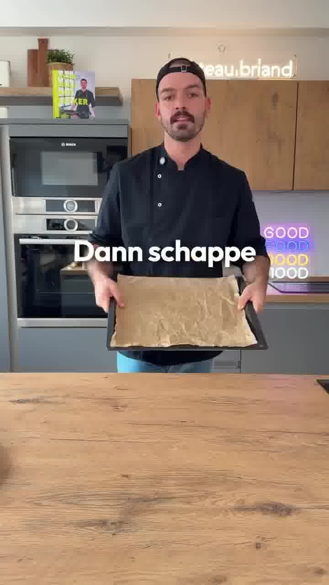

Ein Kindheitsgericht als einfaches Blech: würzig marinierte Hähnchenkeulen auf Kartoffelspalten, Möhren und Zwiebeln — alles zusammen auf einem Blech gebacken. Perfektes Feierabendgericht.

## Zubereitung

1. **Gemüse schneiden:** Die gewaschenen Kartoffeln in Spalten (Wedges) schneiden. Möhren schälen und schräg in grobe Stücke schneiden. Zwiebel in grobe Stücke, Knoblauch in Scheiben schneiden.

   

2. **Marinade anrühren:** Öl mit Curry, edelsüßem und geräuchertem Paprikapulver, Cayennepfeffer, Kreuzkümmel, Salz und reichlich Pfeffer in einer Schale verrühren. Die Marinade passt sowohl zum Hähnchen als auch zum Gemüse.

   

3. **Hähnchen einpinseln:** Die Hähnchenkeulen von beiden Seiten mit einem Teil der Marinade einpinseln.

   

4. **Gemüse mischen & belegen:** Den Rest der Marinade unter das Gemüse (Kartoffeln, Möhren, Zwiebel, Knoblauch) mengen. Auf ein mit Backpapier belegtes Blech (oder in eine große Auflaufform) geben und verteilen. Die Hähnchenkeulen daraufsetzen.

   

5. **Backen:** Im Ofen bei **180 °C ca. 45 Minuten** backen, bis das Hähnchen durch und goldbraun und das Gemüse gar ist.

   

## Notizen & Varianten

- Quelle: Instagram-Reel von **chateau.briand** (Manuel Struck) — „Wieder so ein Kindheitsgericht". Titelbild und Schritt-Fotos aus dem Video.
- **Portionen (4) geschätzt:** 6 Keulen mit Kartoffeln und Möhren ergeben ca. 3–4 Portionen. Mengen über den Portionsrechner anpassbar.
- Ölmenge im Original „so 3, 4, 5 Esslöffel" (Video) bzw. „6–8 EL" (Bildtext) — nach Gefühl dosieren, das Gemüse soll leicht überzogen sein.
- Im Original gab es das Gericht früher mit Pommes statt Kartoffelspalten.
