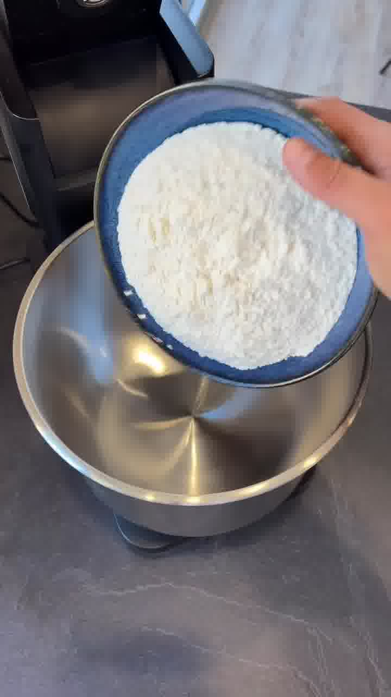
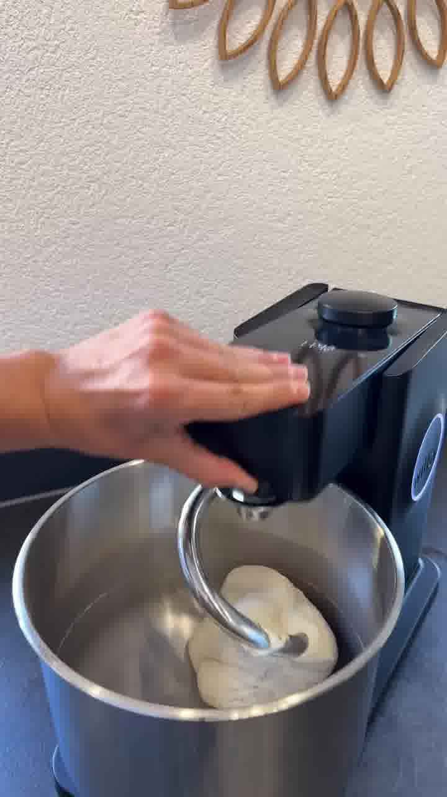
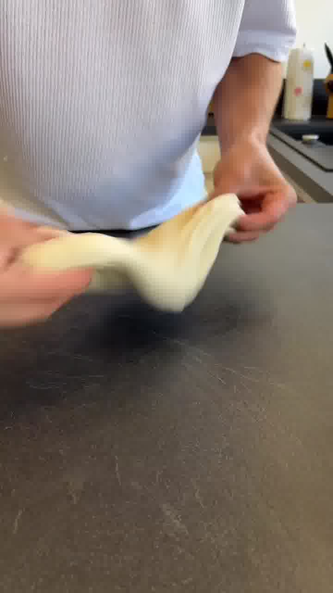
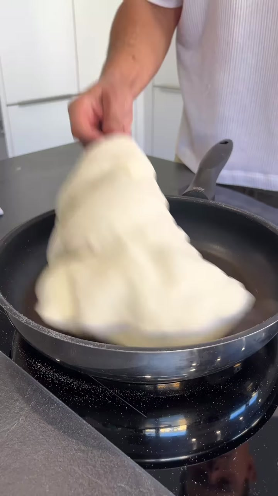

Weiche, selbstgemachte Wraps aus nur vier Zutaten — in der Pfanne gebacken. Belegen, zusammenrollen, fertig. Ergibt 6 Fladen.

## Zubereitung

1. **Teig:** Mehl, Wasser, Salz und das neutrale Öl in eine Schüssel geben und kneten — das dauert etwa **12 Minuten**. Wenn der Teig geschmeidig ist, auf die Arbeitsplatte stürzen und in 6 gleich große Stücke teilen.

   

   

2. **Ruhen:** Die Stücke auf Spannung zu Kugeln schleifen und **30 Minuten** mit einem feuchten Küchentuch abgedeckt ruhen lassen.

   

3. **Ausrollen:** Die Arbeitsplatte mit Mehl bestäuben, eine Kugel darauflegen und mit einem Nudelholz dünn ausrollen. Mit allen weiteren Teiglingen wiederholen und beiseitelegen.

4. **Backen:** Zwei Pfannen auf mittlerer bis hoher Hitze erhitzen und die Fladen von beiden Seiten je **3–4 Minuten** backen. Direkt nach dem Backen ist es wichtig, die Wraps im heißen Zustand mit einem Küchentuch abzudecken — so werden sie besonders weich.

   

5. **Belegen:** Die Fladen mit den Lieblingszutaten belegen, zusammenrollen und genießen.

## Notizen & Varianten

- Quelle: Instagram-Reel von **Sven Teichmann** (teichners_pizza_palace) — „Homemade Wraps". Titelbild und Schritt-Fotos aus dem Video.
- Der Teig lässt sich gut mit einer Küchenmaschine kneten (im Video so gezeigt), geht aber auch von Hand.
