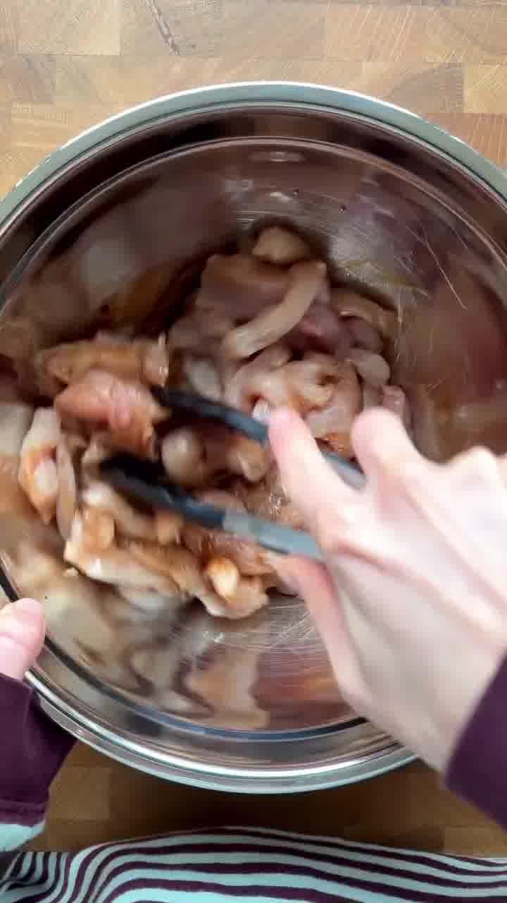
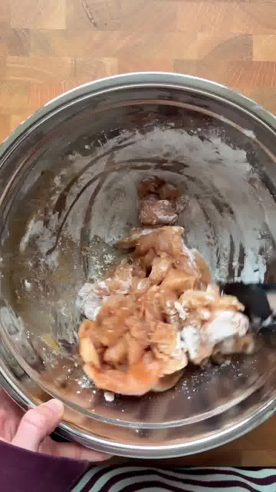
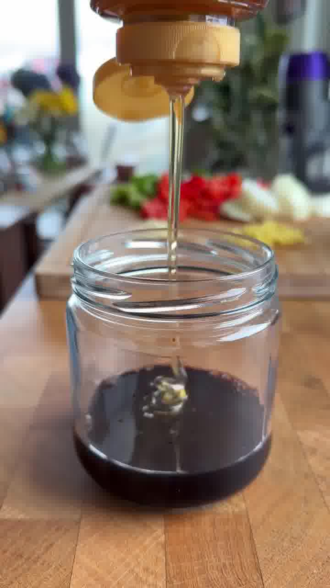
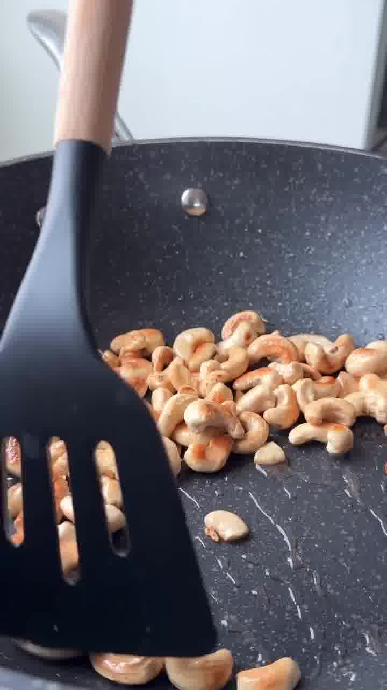

Knuspriges Hähnchen mit gerösteten Cashews, Paprika und Zwiebel in einer klebrig-glänzenden Glasur aus Sojasauce, Honig und Reisessig — schmeckt wie vom Lieblings-Asiaten, mit rund 52 g Protein pro Portion. Über Reis servieren.

## Zubereitung

1. **Vorbereiten:** Das Gemüse schneiden. Alle Zutaten für die Glasur in einem kleinen Glas oder einer Schüssel verrühren und beiseitestellen. Das Hähnchen zuerst mit der dunklen Sojasauce mischen, dann mit Speisestärke, weißem Pfeffer und einer guten Prise Salz.

   

   

   

2. **Cashews rösten:** Einen Schuss neutrales Öl in einem großen Wok oder einer Pfanne bei hoher Hitze erhitzen. Die Cashewkerne **2–3 Minuten** unter häufigem Schwenken goldbraun rösten. Herausnehmen und beiseitestellen.

   

3. **Hähnchen braten:** Bei Bedarf noch etwas Öl zugeben, dann das Hähnchen hineingeben. Es klumpt anfangs leicht — mit einer Zange auseinanderziehen. **5–6 Minuten** goldbraun und durchgaren, dann aus der Pfanne nehmen.

   

4. **Gemüse:** Erneut etwas Öl in die Pfanne geben. Die Zwiebel **2–3 Minuten** anbraten, bis sie weich wird. Paprika und Ingwer zugeben und **4–5 Minuten** unter Rühren braten, dann den Knoblauch zugeben und **30 Sekunden** mitbraten.

5. **Schwenken:** Hähnchen und Cashews zurück in die Pfanne geben, die Glasur darüber gießen und alles schwenken, bis es klebrig und glänzend überzogen ist.

6. **Servieren:** Über Reis anrichten und nach Belieben mit Frühlingszwiebeln und Sesam bestreuen.

## Notizen & Varianten

- Quelle: Instagram-Reel von **Emma Petersen** (thefitlondoner) — „Honey Cashew Chicken". Titelbild und Schritt-Fotos aus dem Video.
- Für 4 Portionen ausgelegt, ca. 52 g Protein pro Portion.
