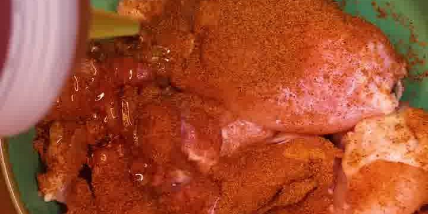
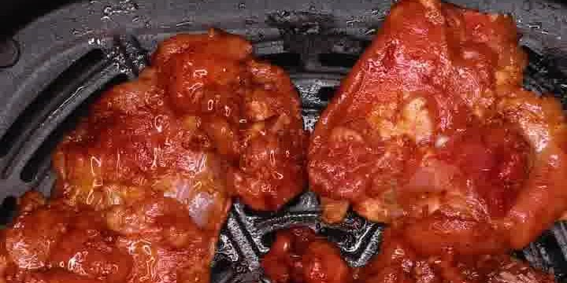

Klebrig-glänzendes Honig-Hähnchen mit rauchig-warmer Gewürzmischung — in nur 16 Minuten aus der Heißluftfritteuse. Aus der Reihe „Chicken you'll actually make", Folge 7, von **afterdarkkitchen**.

## Zubereitung

1. **Würzen:** Die Hähnchenoberschenkel mit Salz, Paprikapulver, Zwiebelpulver, gemahlenem Koriander, schwarzem Pfeffer, Muskat, Chili, Knoblauchpulver, Piment, Selleriesamen und einer kleinen Prise gemahlener Nelken bestreuen.

   

2. **Honig einmassieren:** 1 EL Honig zugeben und die Gewürze samt Honig gründlich ins Fleisch einmassieren.

3. **Air-Fryern:** Bei **200 °C für 16 Minuten** in der Heißluftfritteuse garen, bis das Hähnchen durch und außen glänzend-karamellisiert ist.

   

4. **Servieren:** Nach Wunsch mit etwas extra Honig beträufeln. Mit Reis (oder nach Belieben) servieren.

## Notizen & Varianten

- Quelle: Instagram-Reel von **afterdarkkitchen** („Chicken you'll actually make", Episode 7 — Honey Smokey grilled Air Fryer Chicken). Titelbild und Schritt-Fotos aus dem Video.
- Mengen aus dem Originaltext (US-Teelöffel-Angaben) direkt übernommen; `⅛ TL` ist als `0.125 TL`, `¼ TL` als `0.25 TL` geschrieben. Die Gewürzmischung ist bewusst kleinteilig — wer es einfacher mag, nimmt je eine ordentliche Prise.
- **Garzeit:** Im Rezepttext stehen **16 Minuten**, das eingeblendete Video-Overlay nennt **15 Minuten** — je nach Gerät und Stückgröße 15–16 Minuten, Kerntemperatur beachten.
- **Portionen (2) geschätzt** — 400 g Oberschenkel ergeben ca. 2 Portionen mit Reis (im Video werden für den Beauty-Shot mehr Stücke gebraten).
