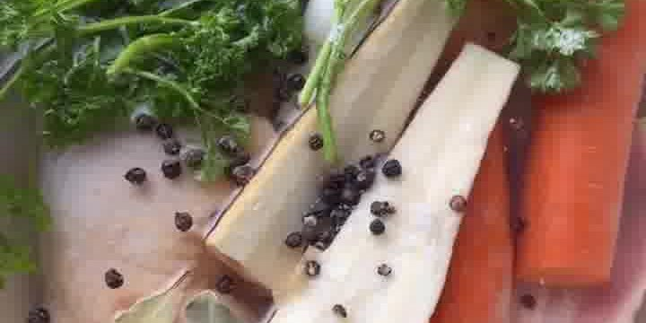

Cremige, zitronige Hühnersuppe mit Reis — das perfekte Wohlfühlessen, auch bei Erkältungen. Aus Pias „Souptember"-Reihe (**piaundhalloumi**), in der sie im September jeden Tag ein Suppen- oder Eintopfrezept teilt.

## Zubereitung

1. **Brühe ansetzen:** Hähnchenschenkel (oder Suppenhuhn), Karotten, Porree, Knollensellerie, Zwiebel, Knoblauch, Ingwer, Lorbeerblätter, Pfefferkörner, Petersilienstiele und Salz in einen großen Topf geben und mit Wasser bedecken. Mindestens **2 Stunden** köcheln lassen.

   

2. **Abseihen:** Die Brühe durch ein Sieb geben. Das Fleisch vom Knochen zupfen und die Karotten klein schneiden — beides beiseitestellen. Die Brühe mit Salz und Pfeffer abschmecken.

3. **Verfeinern:** Zitronenabrieb, Zitronensaft, Crème fraîche und gehackten Dill in die heiße Brühe rühren, bis sie cremig ist.

   

4. **Reis garen:** Den Reis direkt in die Brühe geben und **5–10 Minuten** köcheln lassen, bis er weich ist.

   

5. **Fertigstellen & servieren:** Das gezupfte Fleisch und die geschnittenen Karotten zurück in die Suppe geben und noch einmal mit Salz abschmecken. Mit frischem Pfeffer und etwas Chiliöl getoppt servieren.

   

## Notizen & Varianten

- Quelle: Instagram-Reel von **piaundhalloumi** (Pia) — „Hühnersuppe mit Reis & Zitrone 🍋", aus der „Souptember"-Reihe. Titelbild und Schritt-Fotos aus dem Video.
- Der Reis wird **direkt in der cremigen Suppe** gegart — dadurch zieht er den Geschmack, macht die Suppe aber auch sämiger und bindet über Zeit nach. Wer den Reis lieber körnig hält, kocht ihn separat und gibt ihn erst beim Servieren dazu.
- **Portionen (3) geschätzt** — im Original „für 2–3 Portionen".
- Gekocht wird im Video in einem gusseisernen Topf; Garnitur: dünne Zitronenscheiben, viel frischer Dill, Karottenscheiben und Chiliöl.
