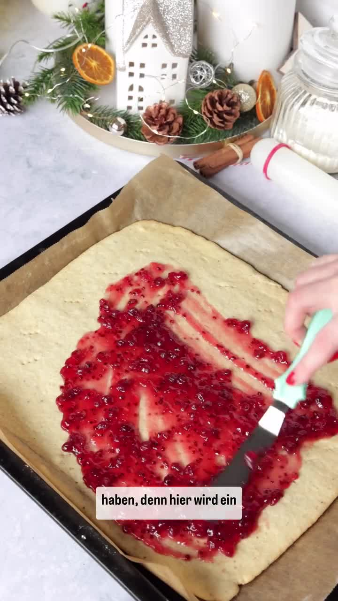
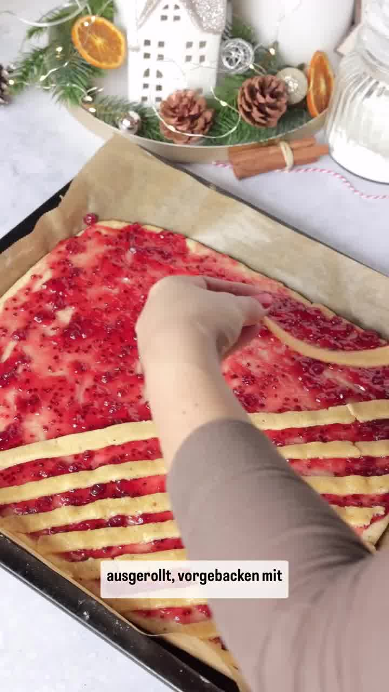

Unkomplizierter Klassiker für die Weihnachtsbäckerei: ein Haselnuss-Mürbeteig wird rechteckig ausgerollt, vorgebacken, mit Johannisbeermarmelade bestrichen und mit Teigstreifen belegt. Nach dem Backen einfach in schmale Streifen schneiden — kein Ausstechen nötig.

## Zubereitung

1. **Teig:** Alle Zutaten für den Teig (Mehl, Butter, gemahlene Haselnüsse, Puderzucker, Eier, Backpulver, Zimt, Nelkenpulver, Salz und Zitronenabrieb) vermengen und in Frischhaltefolie wickeln. Mindestens **1 Stunde**, gerne über Nacht, in den Kühlschrank legen.

2. **Vorbacken:** Den Backofen auf **180 °C Ober- und Unterhitze** vorheizen. Zwei Drittel des Teiges auf einem Backpapier ca. **3 mm dick** zu einem Rechteck (ca. 28 × 33 cm) ausrollen — beim Ausrollen ruhig Mehl nehmen, der Teig ist sehr weich. Das Backpapier vorsichtig auf ein Backblech ziehen. Den Teig mit einer Gabel mehrmals einstechen und ca. **10 Minuten** im unteren Drittel des Ofens vorbacken.

3. **Marmelade:** Den übrig gebliebenen Teig noch einmal kaltstellen. Die Johannisbeermarmelade erwärmen und den vorgebackenen Teig damit bestreichen.

   

4. **Streifen belegen:** Das gekühlte Teigstück dünn ausrollen und in ca. **1 cm breite Streifen** schneiden. Die Streifen vorsichtig diagonal mit ca. 1,5 cm Abstand auf die Marmelade legen.

   

5. **Backen:** Auf der mittleren Schiene ca. **15–20 Minuten** backen.

6. **Bestäuben & schneiden:** Die Teigplatte vollständig auskühlen lassen, mit Puderzucker bestäuben und mit einem scharfen Messer in schmale Streifen schneiden.

   

   

## Notizen & Varianten

- Quelle: Instagram-Reel von **Katharina** (katharinas_cakes_) — „Linzer Streifen" (Tag 7 der Plätzchen-Reihe). Titelbild und Schritt-Fotos aus dem Video.
- Die Portionsangabe (ca. 40 Streifen) ist eine Schätzung — je nach Schnittbreite mehr oder weniger.
- Luftdicht verpackt lagern.
