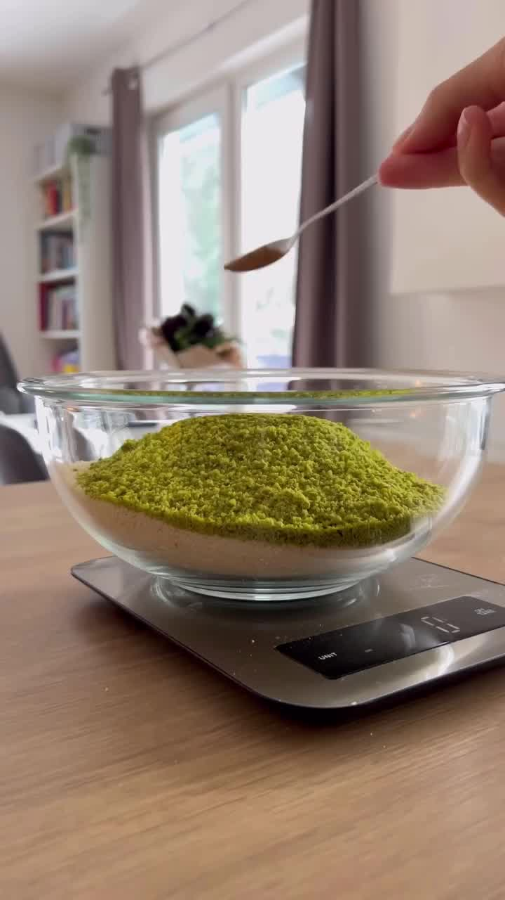
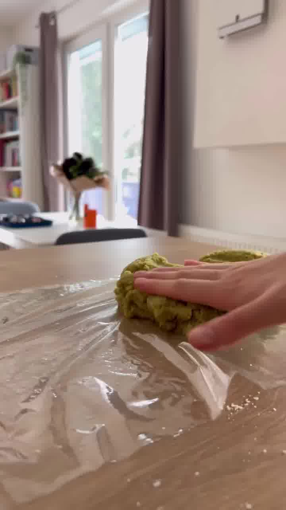
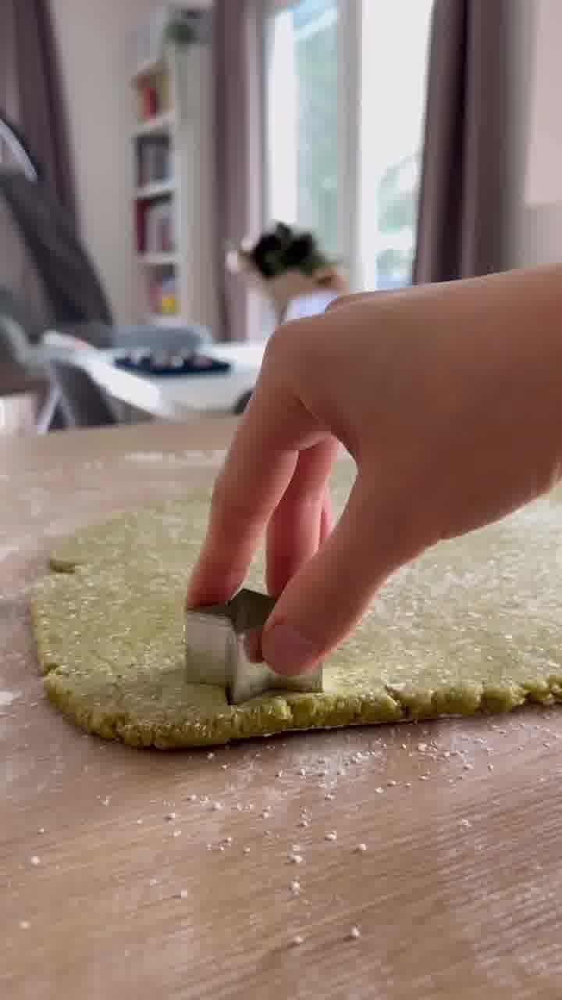
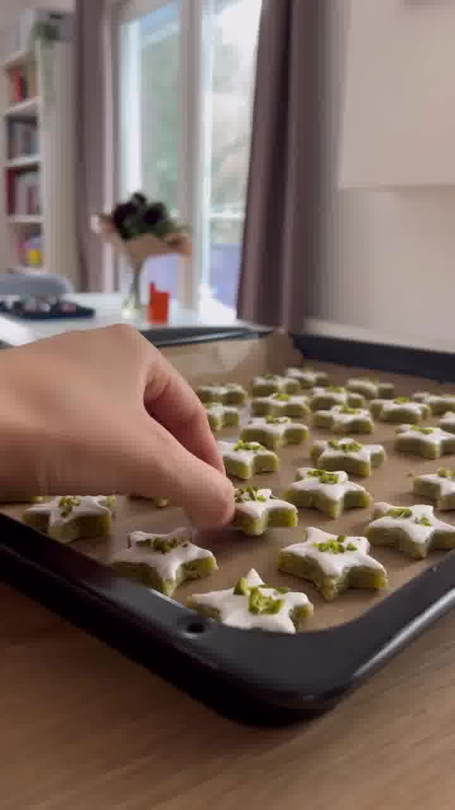
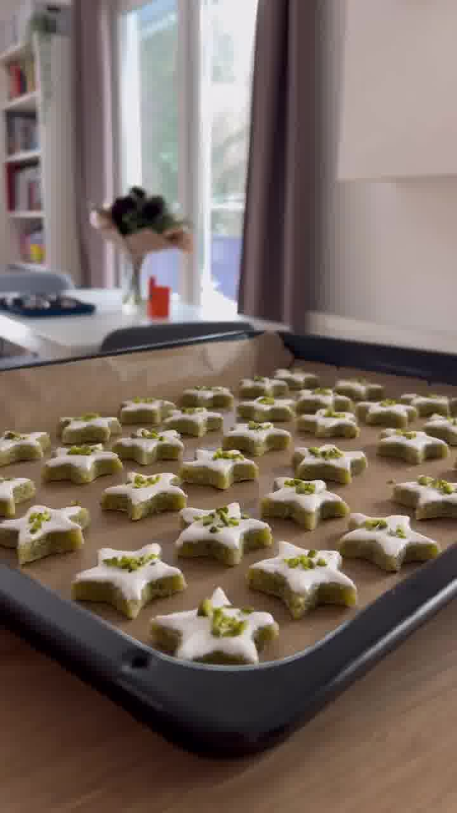

Saftige Sterne aus gemahlenen Mandeln und Pistazien mit einer Puderzucker-Glasur und gehackten Pistazien — ein weihnachtliches Gebäck ganz ohne Mehl. Ergibt ca. 60 Sterne.

## Zubereitung

1. **Teig:** Alle Zutaten für den Teig in eine Schüssel geben und gut verkneten.

   

2. **Ruhen:** Den Teig kurz in Folie einpacken und währenddessen das Icing vorbereiten.

   

3. **Icing:** Für das Icing Eiweiß und Puderzucker steif schlagen.

4. **Ausstechen:** Den Teig mit Puderzucker ausrollen und mit einem Sternausstecher ausstechen. Den Ausstecher am besten immer etwas anfeuchten.

   

5. **Glasieren:** Das Icing mit einem Pinsel auf die Sterne streichen.

   

6. **Deko:** Gehackte Pistazien auf den Sternen verteilen.

   

7. **Backen:** Im vorgeheizten Ofen bei **150 °C Ober-/Unterhitze** ca. **9 Minuten** backen.

## Notizen & Varianten

- Quelle: Instagram-Reel von **Fatmanur Kılıç** (kilic_story) — „Mandel-Pistazien-Sterne". Titelbild und Schritt-Fotos aus dem Video.
