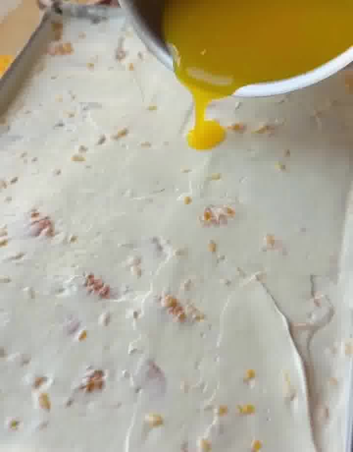

Fruchtig-cremiges No-Bake-Schichtdessert im Solero-Stil: lockere Skyr-Schmand-Creme mit Mandarinen, in Maracujasaft getränkte Löffelbiskuits und ein fruchtiger Maracuja-Spiegel obendrauf. Schnell vorbereitet, nach ein paar Stunden im Kühlschrank herrlich erfrischend (ca. 158 kcal, 7 g Eiweiß pro Stück). Weiter unten die verwandte **Variante Mango-Maracuja** mit Mascarpone-Sahne-Creme.

## Zubereitung

1. **Erste Schicht:** 18 Löffelbiskuits von beiden Seiten kurz in den Maracujasaft (100 ml) tauchen — nicht zu lange einweichen — und als erste Schicht in die Form legen.

2. **Creme:** Die Cremefine mit den 2 Päckchen Sahnesteif steif schlagen. Skyr und Schmand verrühren, die geschlagene Cremefine vorsichtig unterheben. Die klein gehackten Mandarinen unterrühren.

3. **Schichten:** Die Hälfte der Creme auf den Löffelbiskuits verstreichen. Die restlichen 18 Löffelbiskuits ebenfalls kurz in den Maracujasaft tauchen, als zweite Schicht auflegen und die restliche Creme gleichmäßig daraufstreichen.

4. **Maracuja-Spiegel:** Die 200 ml Maracujasaft mit dem Vanillepuddingpulver klümpchenfrei verrühren. In einem kleinen Topf unter Rühren kurz aufkochen, bis die Masse leicht andickt. Den Spiegel gleichmäßig über der Creme verteilen.

   

5. **Kühlen:** Mindestens **4 Stunden** im Kühlschrank kalt stellen.

## Notizen & Varianten

- Quelle: Instagram-Reel von **Bekki** (kcallicious) — „Solero Tiramisu". Zutaten und Ablauf vollständig aus der Caption, Titelbild (angeschnittenes Stück) und Schrittbild aus dem Video.
- **Nährwerte (Solero-Variante):** gesamt ca. 2.540 kcal · 112 g Eiweiß · 287 g KH · 98 g Fett; pro Stück ca. 158 kcal · 7 g Eiweiß · 18 g KH · 6 g Fett.
- „1 Becher Cremefine" meint einen handelsüblichen Becher (ca. 200 ml) Cremefine bzw. Rama Cremefine (19 %).

### Variante: Mango-Maracuja-Dessert (Mascarpone-Sahne-Creme)

Dasselbe Prinzip — getränkte Löffelbiskuits, Creme, fruchtiger Guss — aber mit einer reichhaltigeren Mascarpone-Sahne-Creme (ohne Frucht in der Creme) und einem Guss aus Vanillesoße und Maracuja-Orangensaft. Quelle: Instagram-Reel von **reyhann.yaman** ([Reel](https://www.instagram.com/reel/DaxyhwyiW_X/)).

**Zutaten:** 200 g Löffelbiskuits · Maracuja-Orangensaft zum Eintauchen · 200 g Mascarpone · 200 g Speisequark (40 %) · 400 ml Schlagsahne · 2 Päckchen Sahnesteif · 2 EL Zucker · 2 Päckchen Vanille-Dessertsoße (ohne Kochen) · 400 ml Maracuja-Orangensaft für den Guss.

**Zubereitung:** Löffelbiskuits kurz in den Maracuja-Orangensaft tauchen und in eine Auflaufform legen. Mascarpone, Quark, Schlagsahne, Sahnesteif und Zucker cremig aufschlagen und auf den Löffelbiskuits verteilen. Die Vanillesoße mit 400 ml Maracuja-Orangensaft anrühren und gleichmäßig über die Creme geben. Mindestens 2 Stunden — am besten über Nacht — kalt stellen.
