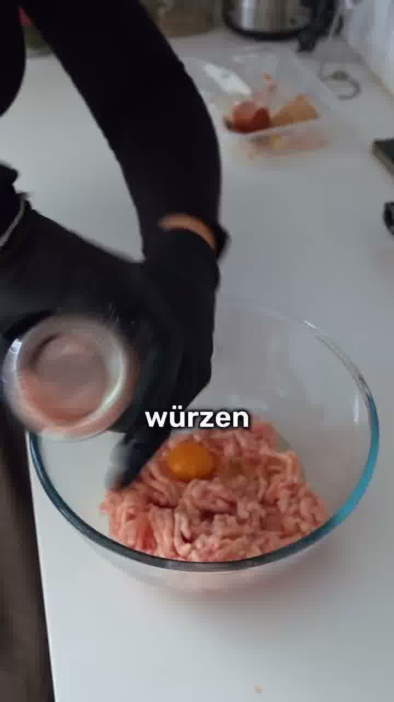
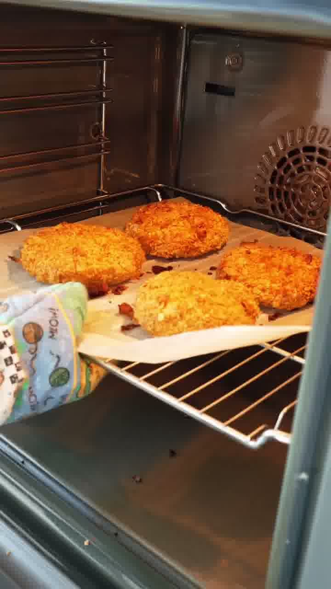

Selbst gemachte „McCrispy"-Hähnchenburger im McDonald's-Stil — mit knuspriger Cornflakes-Panade aus dem Ofen statt frittiert. Laut Autorin in doppelter Größe und mit fast 50 % weniger Kalorien.

## Zubereitung

1. **Patties würzen & formen:** Das Hähnchen-Hackfleisch mit 1 Ei, Salz, Pfeffer und Knoblauchpulver kräftig verkneten und zu großen Patties formen.

   

2. **Cornflakes-Panade:** Die Cornflakes zerdrücken (zermantschen) und die Patties darin rundum wenden, bis sie paniert sind.

   

3. **Backen:** Die panierten Patties auf ein Blech setzen und **20 Minuten bei 189 °C Umluft** im Ofen backen, bis sie goldbraun und knusprig sind.

   

4. **Sauce:** Joghurt, Gurkenwasser, Ketchup und Senf verrühren und mit Salz und Pfeffer abschmecken.

   

5. **Belegen:** Die Burger Buns mit Sauce bestreichen, mit Salat, einem Patty und Sauergurken belegen und den Deckel aufsetzen.

   

## Notizen & Varianten

- Quelle: Instagram-Reel von **pineazz** (Zana Muzlijaj) — „MC CRISPY wie von McDonald's". Titelbild und Schritt-Fotos aus dem Video.
- **Ei und Senf** stehen nicht in der Zutatenliste der Caption, werden im Video aber deutlich mit eingeblendet (1 Ei ins Hack, Senf in die Sauce) — daher ergänzt.
- **189 °C Umluft** ist die exakte Temperatur-Angabe aus dem Original.
- Idee laut Autorin: doppelte Größe und ca. 50 % weniger Kalorien als das Fast-Food-Original.
