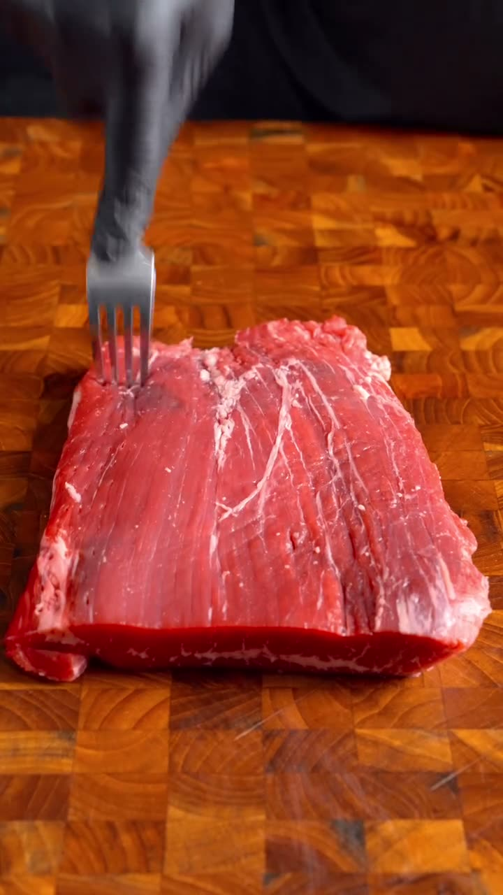
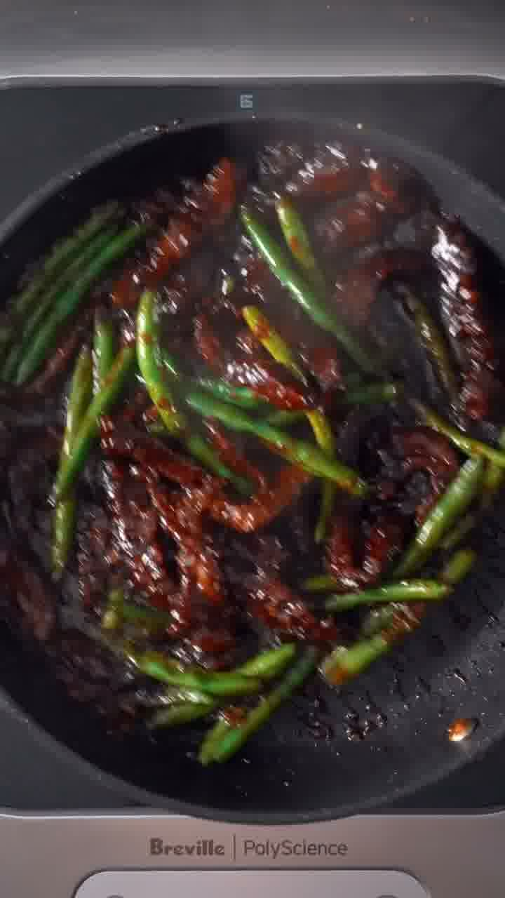
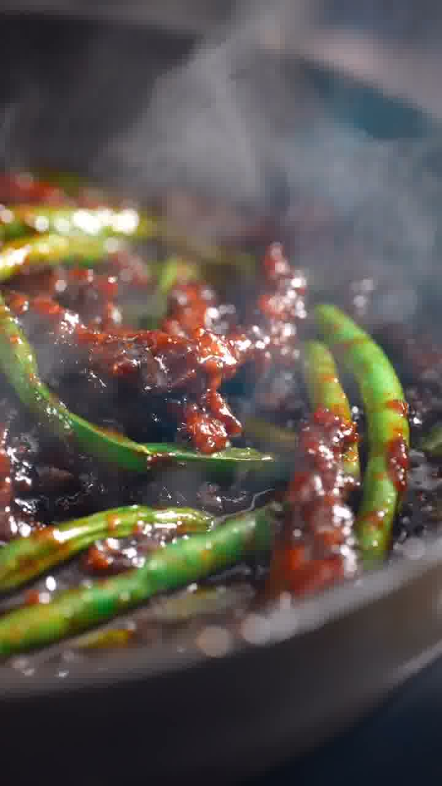

Knusprig frittierte Rindfleischstreifen in einer klebrig-glänzenden, süß-scharfen Sauce aus Sojasauce, braunem Zucker, Ingwer, Knoblauch und Chiliflocken — mit grünen Bohnen und Sesam über Reis.

## Zubereitung

1. **Fleisch plattieren:** Das Flankensteak auf beiden Seiten mehrfach mit einer Gabel einstechen — das macht es zarter.

   

2. **Schneiden:** Das Fleisch in dünne Streifen schneiden, quer zur Faser.

3. **In Speisestärke wenden:** Die Streifen in einer Schüssel großzügig mit Speisestärke wenden, bis sie rundum bedeckt sind. Überschüssige Stärke abschütteln.

   

4. **Frittieren:** Das Öl in einer Pfanne oder einem Wok erhitzen. Das Fleisch portionsweise ca. **2–3 Minuten** knusprig und goldbraun ausbacken. Herausnehmen und auf Küchenpapier abtropfen lassen.

   

5. **Sauce anrühren:** Ingwer, Knoblauch, braunen Zucker, Sojasauce, Chiliflocken und Wasser in einer Schüssel verrühren.

   

6. **Einkochen:** Bis auf ca. 1 EL das Öl aus der Pfanne abgießen. Die Sauce in die heiße Pfanne geben und aufkochen, bis sie sirupartig einkocht.

7. **Grüne Bohnen:** Die grünen Bohnen dazugeben und in der Sauce schwenken, bis sie gar, aber noch knackig sind.

   

8. **Schwenken:** Das knusprige Fleisch zurück in die Pfanne geben und alles schwenken, bis es glänzend überzogen ist. Mit Sesam bestreuen.

   

9. **Servieren:** Über Reis anrichten und mit Frühlingszwiebeln und Sesam garnieren.

## Notizen & Varianten

- **Rekonstruktion:** Quelle ist ein Instagram-Reel von **Zach** — ein reines **ASMR-Koch­video ohne Rezepttext** (Caption nur „would you eat this? #asmr #cooking"). Der **Ablauf und alle Bilder** stammen 1:1 aus dem Video (Fleisch plattieren → schneiden → in Stärke wenden → frittieren → Sauce aus Ingwer/Knoblauch/braunem Zucker/Sojasauce/Chiliflocken → grüne Bohnen → schwenken → über Reis).
- **Mengen sind geschätzt:** Das Video zeigt keine Grammangaben. Die Mengen orientieren sich an vergleichbaren Crispy-Mongolian-Beef-Rezepten ([RecipeTin Eats](https://www.recipetineats.com/crispy-sticky-mongolian-beef/), [The Woks of Life](https://thewoksoflife.com/mongolian-beef-recipe/)) und sind nach Geschmack anzupassen — vor allem Zucker/Sojasauce (Süße-Salz-Balance) und Chiliflocken (Schärfe).
- Statt Flankensteak gehen auch Bavette, Rumpsteak oder Roastbeef in dünnen Streifen. Wer es weniger frittiert mag, brät das Fleisch in weniger Öl scharf an.
