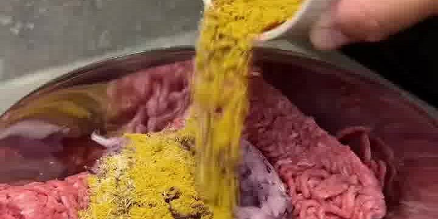
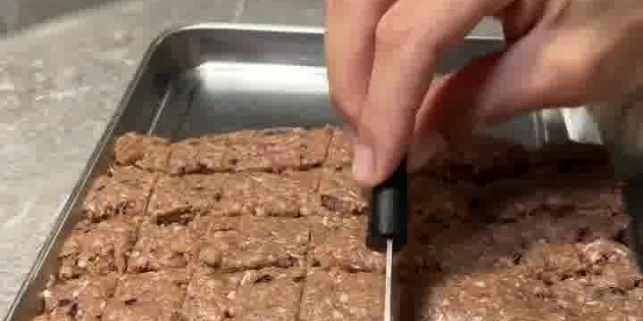
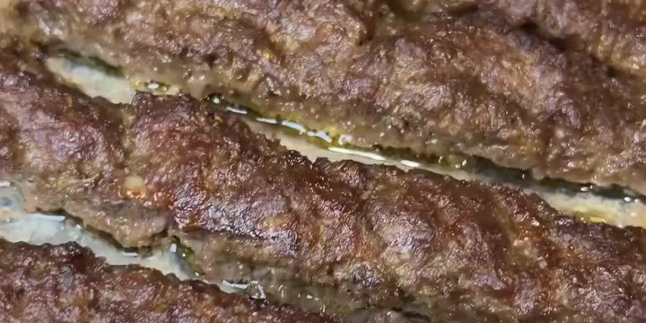
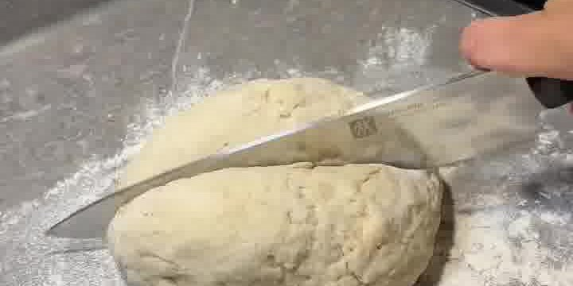

Saftiges Kebab vom Backblech statt vom Drehspieß: würzig geknetetes Hackfleisch, dazu selbstgemachtes Skyr-Fladenbrot, eine cremige Joghurt-Knoblauch-Soße und ein frischer Tomate-Gurke-Salat. High-Protein-Feierabendessen von **fina.cooks**.

## Zubereitung

1. **Hackfleisch würzen und kneten:** Das Hackfleisch mit der geriebenen Zwiebel, dem Knoblauch und den Gewürzen (Salz, Pfeffer, Knoblauchpulver, Paprikapulver, Currypulver) sowie der gehackten Petersilie in einer Schüssel ordentlich verkneten, bis eine gleichmäßige Masse entsteht.

   

2. **Aufs Blech streichen und einschneiden:** Die Hackfleischmasse gleichmäßig auf einem Backblech verteilen und flach glattstreichen. Mit einem Messer in gleich große Stücke (Kebab-Streifen) einschneiden.

   

3. **Backen:** Im Ofen bei **180 °C Ober-/Unterhitze ca. 20 Minuten**, danach **180 °C Umluft weitere 20 Minuten** backen, bis das Fleisch durch und saftig gebräunt ist.

   

4. **Fladenbrot-Teig:** Während das Fleisch backt, Mehl, Backpulver, Skyr, Salz und Olivenöl zu einem geschmeidigen Teig verrühren (keine Ruhezeit nötig). Sobald der Teig zusammenkommt, in 5–6 gleich große Stücke teilen.

   

5. **Fladen backen:** Die Teigstücke rund ausrollen und in einer Pfanne (ohne oder mit wenig Fett) von beiden Seiten backen. Anschließend mit etwas Butter bestreichen und mit einem Handtuch abdecken, damit die Fladen schön weich bleiben.

6. **Joghurt-Knoblauch-Soße:** Mayonnaise, Skyr, fein geriebenen Knoblauch, Zitronensaft und Agavendicksaft verrühren, mit Salz und Pfeffer abschmecken.

7. **Salat:** Tomaten, Gurke und rote Zwiebel klein schneiden, mit gehackter Petersilie mischen und mit etwas Zitronensaft und Olivenöl anmachen.

8. **Anrichten:** Fladenbrot mit der Joghurt-Soße bestreichen, Salat daraufgeben, die Kebab-Stücke darauflegen und mit Salat und Soße toppen. Servieren.

## Notizen & Varianten

- Quelle: Instagram-Reel von **fina.cooks** (Serafina) — „Ofen-Kebab 🥙🔥". Original-Titelbild und Schritt-Fotos aus dem Video.
- **Portionen (4) geschätzt** — die Fleischmenge (500–600 g) und 5–6 Fladenbrote ergeben ca. 4 Portionen.
- Gewürze im Original **ohne Mengenangabe** („nach Geschmack") — im Video ist eine Mischung aus kräftig gelbem Curry-/Paprikapulver, getrockneten Kräutern und einer Pfeffer-Salz-Mischung zu sehen. Nach eigenem Geschmack dosieren.
- Im Reel wird **Rinderhack** verwendet; jedes Hackfleisch (auch gemischt) funktioniert. „Skyr" ist ein fettfreier Protein-Frischkäse (im Video Marke *You*) — ersatzweise Magerquark oder griechischer Joghurt.
