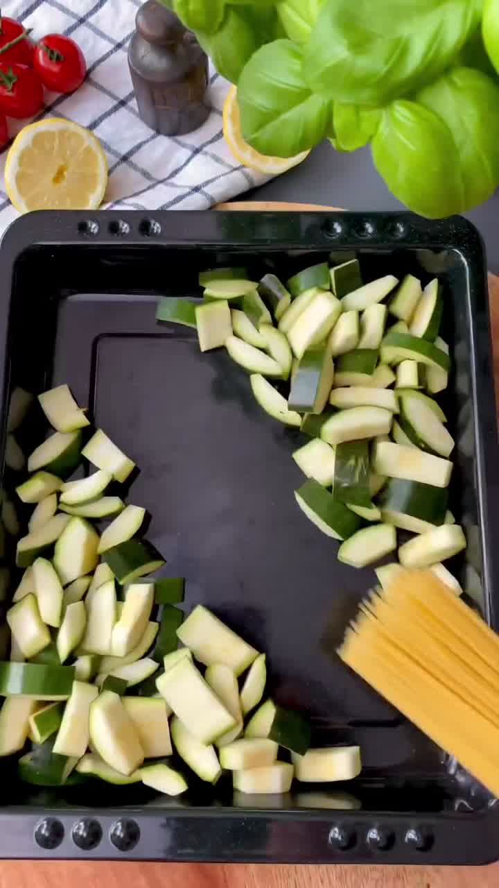
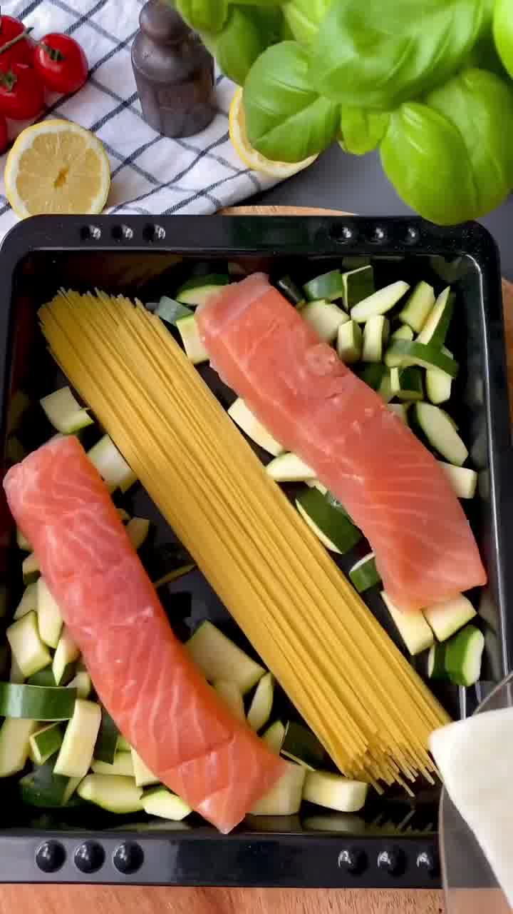
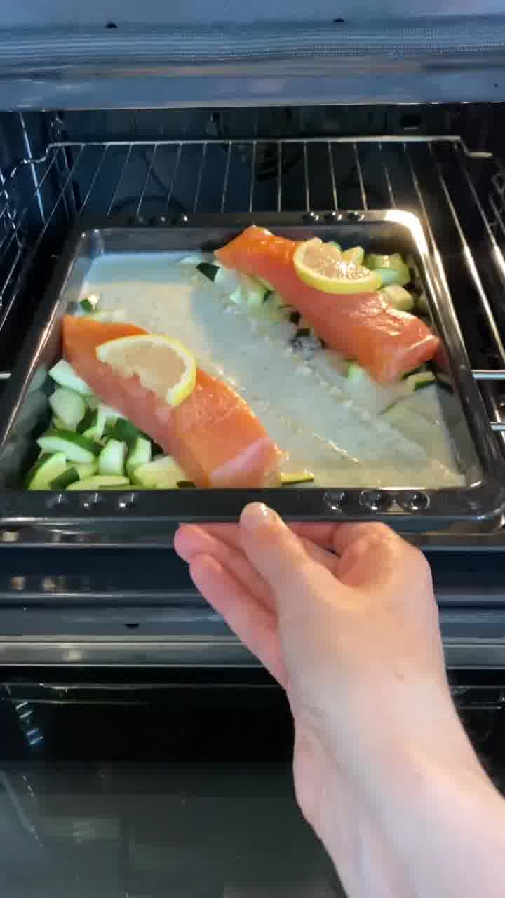
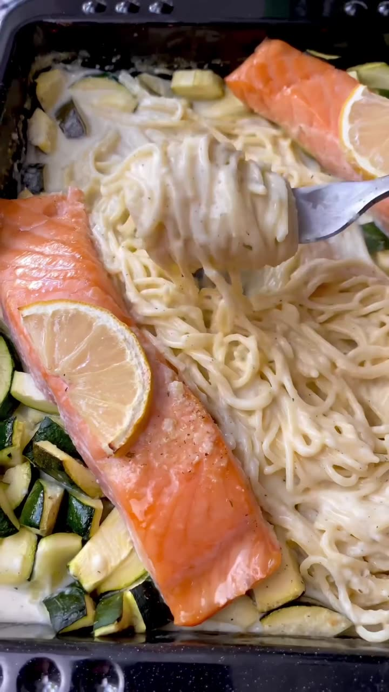

Schnelle One-Pot-Ofenpasta: Zucchini, Spaghettini und Lachs kommen roh in die Auflaufform, die cremige Zitronensoße wird darübergegossen — der Ofen macht den Rest. Rund 38 g Eiweiß pro Portion.

## Zubereitung

1. **Gemüse:** Die Zucchini schneiden (das weiche Innere kann man herausschneiden oder drinlassen) und in eine Auflaufform geben.

   

2. **Anrichten:** Die Spaghettini und den Lachs dazugeben.

   

3. **Soße:** Cremefine, Wasser, Parmesan, Zitronensaft, Salz, Knoblauchpulver und etwas Süße verrühren und über die Pasta gießen, sodass diese bedeckt ist.

   

4. **Backen:** Alles bei **200 °C Ober-/Unterhitze** für ca. **35 Minuten** in den Ofen geben. Zwischendurch die Pasta mit einer Gabel durchmischen, damit sich die Flüssigkeit verteilt und die Nudeln nicht zusammenkleben.

   

5. **Abschmecken:** Zum Schluss den Lachs und das Gemüse noch etwas würzen. Fertig.

## Notizen & Varianten

- Quelle: Instagram-Reel von **Caroline Winnefeld** (caro.calorie) — „One-Pot-Ofenpasta mit Lachs". Titelbild und Schritt-Fotos aus dem Video.
- **Nährwerte** (laut Autorin, pro Portion): 561 kcal · 55 g KH · 38 g EW · 18 g Fett.
- Im Original werden zwei Marken-Würzprodukte (ein Knoblauch-Gewürz und ein geschmacksneutraler Süß-Zusatz) verwendet — hier durch Knoblauchpulver, Dill und eine Messerspitze Zucker ersetzt.
