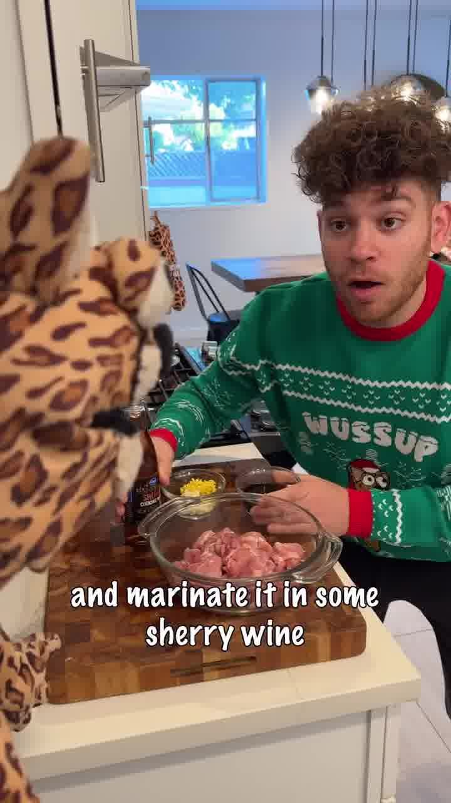
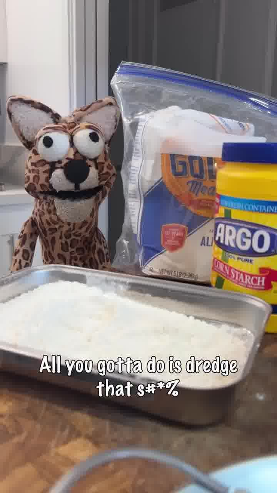
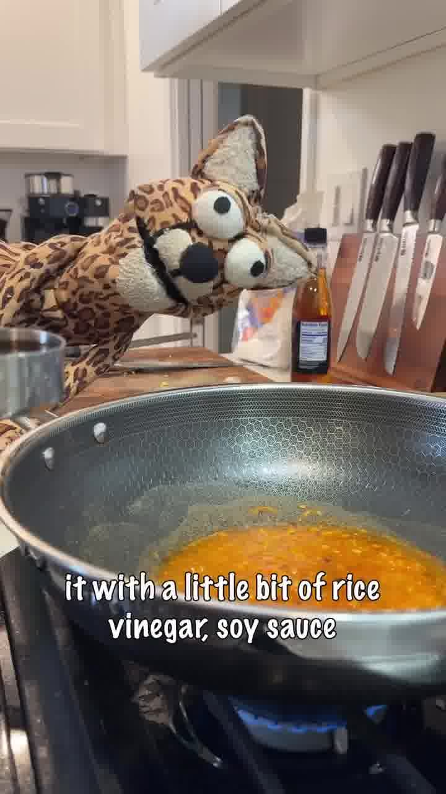
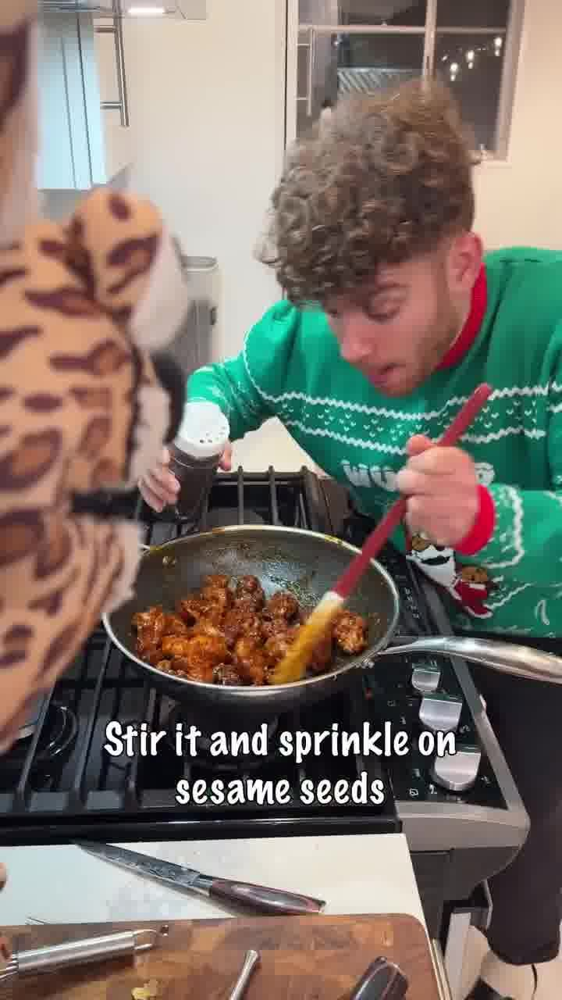

Süß-würziges Orange Chicken mit knuspriger Panade aus dem Airfryer, in einer Orangensauce mit Chili, Ingwer und Zimt geschwenkt. Serviert mit Reis.

## Zubereitung

1. **Hähnchen marinieren:** Hähnchenschenkel in Stücke schneiden und in Sherry mit Sojasauce, Knoblauch und Ingwer marinieren. Abgedeckt **30 Minuten** im Kühlschrank durchziehen lassen.

   

   

2. **Panieren:** Die marinierten Stücke in einer Mischung aus Mehl und Speisestärke wenden, dann in verquirltem Ei und noch einmal in Mehl/Stärke.

   

3. **Garen:** Im Airfryer **20 Minuten** knusprig garen.

   

4. **Orangensauce:** Eine 12-Zoll-Pfanne erhitzen. Orangensaft und etwas abgeriebene Orangenschale, Chilipaste und Knoblauch zugeben und verrühren. Mit Reisessig, Sojasauce, Ingwer, braunem Zucker und einer Prise Zimt abschmecken. Etwa **15 Minuten** einkochen lassen.

   

5. **Schwenken:** Das fertige Hähnchen in die Sauce geben, gut durchschwenken und mit Sesam bestreuen.

   

6. **Servieren:** Mit Reis anrichten und mit Schnittlauch bestreuen.

## Notizen & Varianten

- Quelle: Instagram-Reel von **goodboy.noah** — „Orange Chicken". Titelbild und Schritt-Fotos aus dem Video.
- **Keine Mengenangaben:** Das Reel nennt keine Mengen — die Zutaten sind ohne Grammangaben gelistet und nach Gefühl zu dosieren. Auch die Portionszahl (2) ist geschätzt. Als Orientierung: klassisches Orange Chicken nutzt für die Sauce grob gleiche Teile Orangensaft und braunen Zucker mit je einem Schuss Sojasauce und Reisessig.
- **Sherry:** Im Ton klingt es nach „cherry wine", der eingeblendete Text sagt aber eindeutig **sherry wine** (Sherry).
