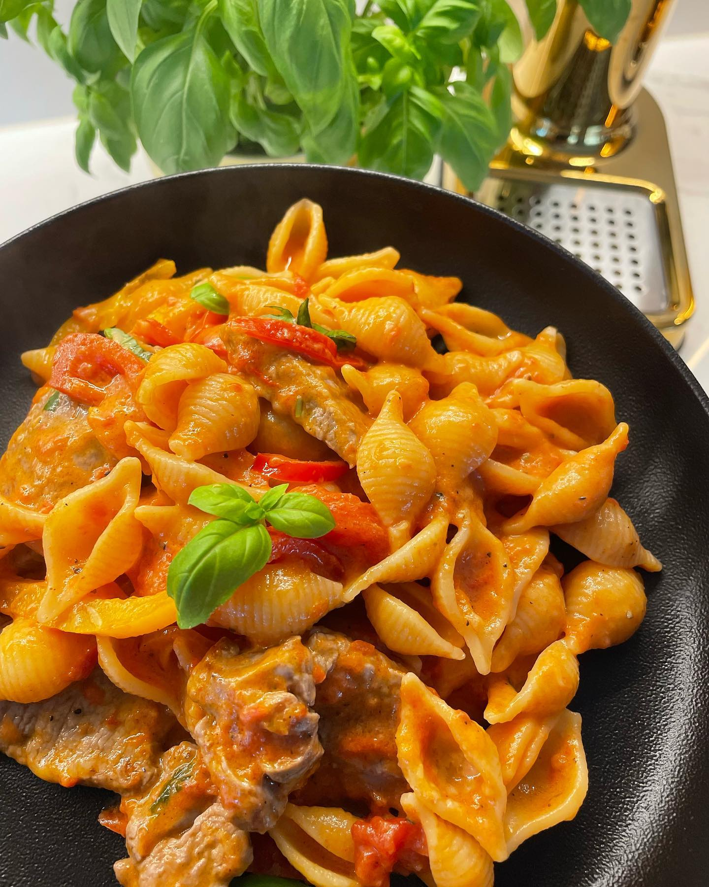
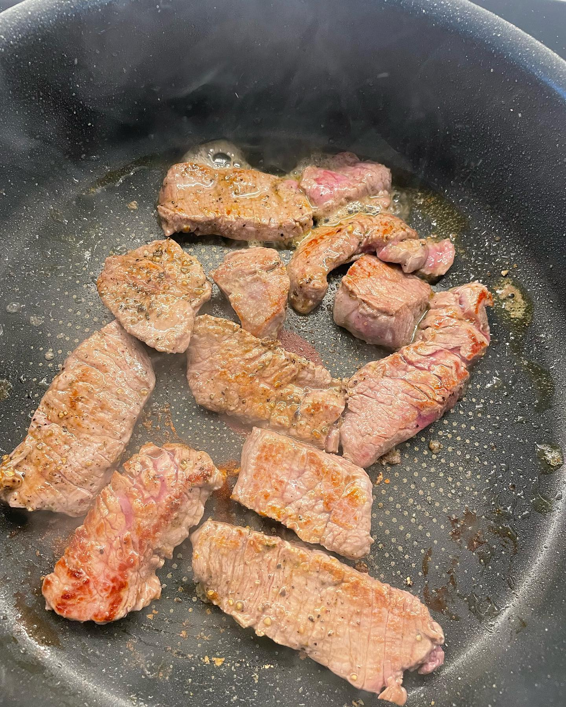
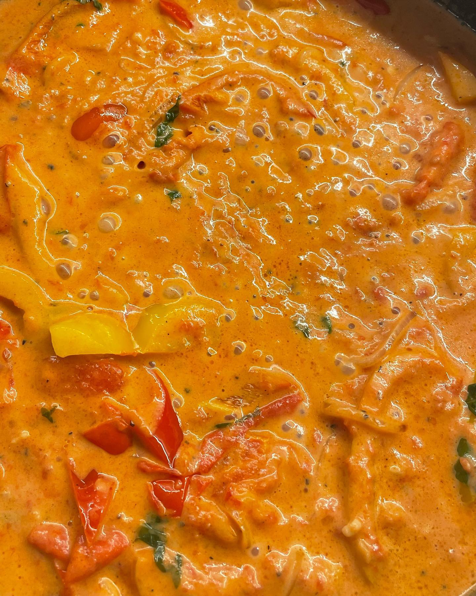
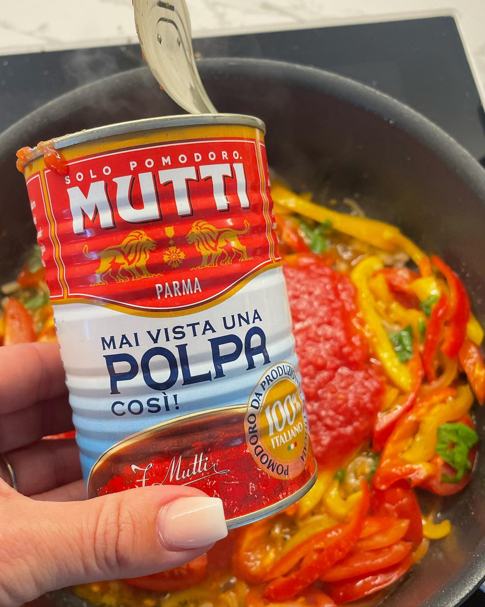

Schnelle Pasta mit zartem Rinderfilet in einer fruchtigen Paprika-Tomaten-Sahne-Sauce mit Basilikum.

## Zubereitung

1. **Rinderfilet:** Das Rinderfilet in feine Streifen schneiden und in einer Pfanne ganz kurz scharf anbraten. Mit Salz und Pfeffer würzen und beiseitestellen.

   

   

2. **Gemüse:** Die rote und gelbe Paprika in Streifen und die Zwiebel in dünne Scheiben schneiden, die Cocktailtomaten halbieren. Alles in etwas Olivenöl und Butter leicht anbraten. Das geschnittene Basilikum (ca. 8 Blätter) dazugeben.

   

3. **Sauce:** Mit den fein gehackten Tomaten und der Sahne aufgießen. Mit Salz, Pfeffer und einer gepressten Knoblauchzehe abschmecken und etwas einkochen lassen.

   

4. **Pasta:** Die Pasta abkochen, beim Abgießen etwas Pastawasser auffangen (nicht zu viel).

5. **Zusammenführen:** Die Pasta zur Sauce geben, das Rindfleisch untermischen und schauen, ob die Konsistenz passt — sonst noch etwas Pastawasser dazugeben. Mit ca. 20 g Parmesan bestreuen und servieren.

## Notizen & Varianten

- Quelle: Instagram-Post von **Anna** (annas_rezepte_) — „Pasta mit Rinderfilet in einer Paprika-Tomaten-Sahne-Sauce". Titel- und Schritt-Bilder sind die Prozessfotos aus den Post-Slides (ein fertiges Tellerfoto gab es im Post nicht).
- **Pasta-Menge:** Die Autorin nennt keine genaue Menge — ca. 200 g gekochte Pasta sind eine sinnvolle Annahme für 2 Portionen.
