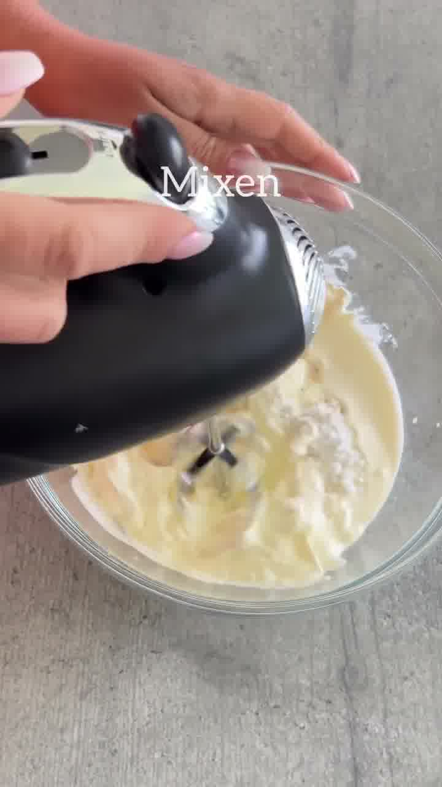
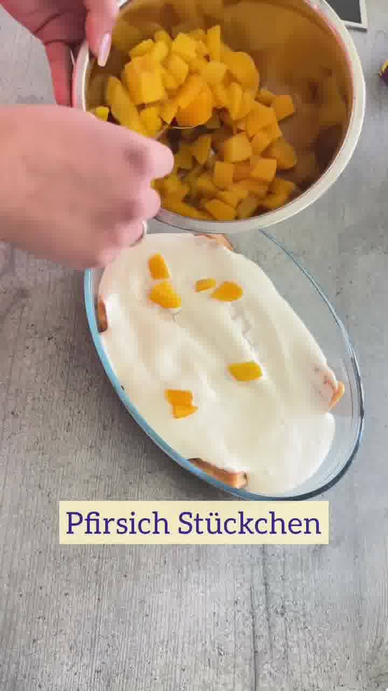
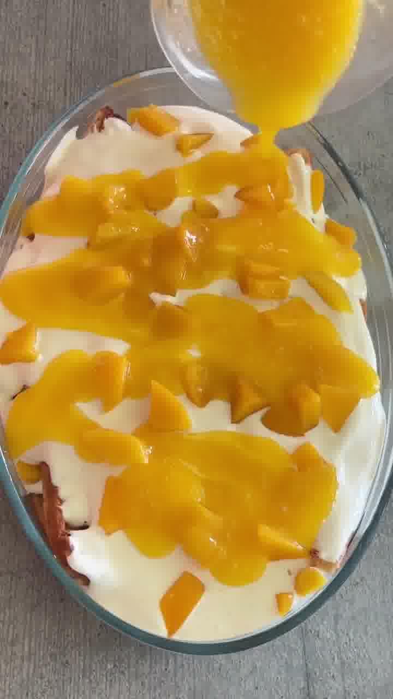

Fruchtig-frisches No-Bake-Dessert mit Pfirsich und Schmand — geschichtet mit Waffeln und einem Maracuja-Guss. Schmeckt wie ein Solero-Eis.

## Zubereitung

1. **Creme:** Für die Creme Schmand, Schlagsahne, Puderzucker, Zitronenabrieb und Vanillepaste cremig aufmixen.

   

2. **Pfirsiche:** Die Pfirsiche würfeln.

3. **Boden:** Die Waffeln in die Form geben, sodass der Boden bedeckt ist.

4. **Schichten:** Nun abwechselnd schichten: Waffeln, Creme und Pfirsiche — bis alles aufgebraucht ist.

   

5. **Guss:** Zum Schluss den Maracujasaft mit dem Dessertsoßen-Pulver aufmixen und über die Form gießen.

   

6. **Kühlen:** Für ca. **2 Stunden** kalt stellen und genießen.

## Notizen & Varianten

- Quelle: Instagram-Reel von **Dine Berrios** (foodlover_dine) — „Pfirsich-Schmand-Dessert, no bake". Titelbild und Schritt-Fotos aus dem Video; das Video zeigt als Guss **Maracujasaft** (Marke „happy day") gemischt mit einer **Vanille-Dessertsoße ohne Kochen**.
- Pfirsiche aus der Dose funktionieren gut; frische Pfirsiche gehen genauso.
