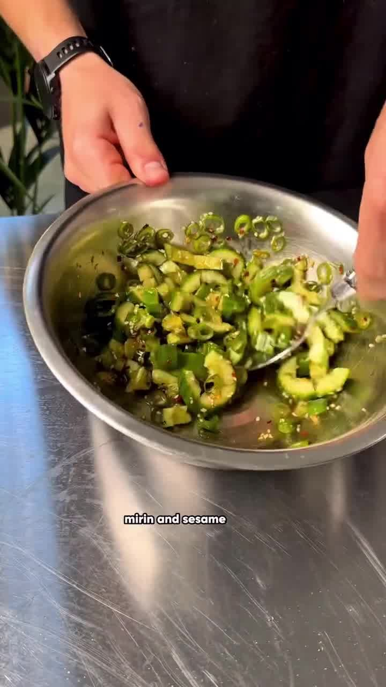
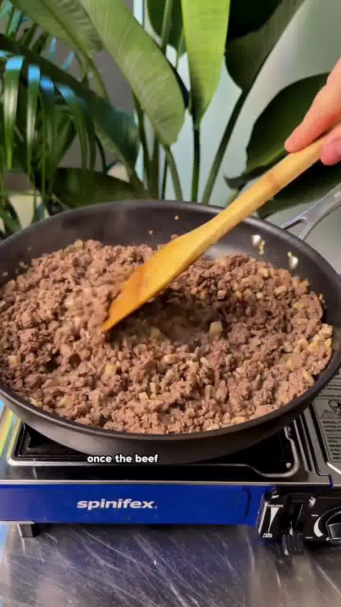
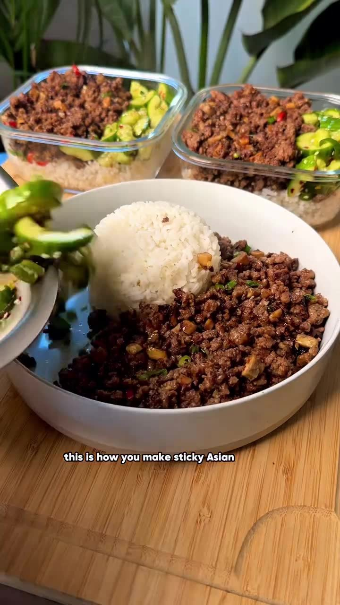

Klebrig-karamellisiertes asiatisches Rinderhack mit erfrischendem Smashed-Gurkensalat und Reis — in rund 20 Minuten fertig. Ideales High-Protein-Meal-Prep mit fast 60 g Protein pro Portion.

## Zubereitung

1. **Gurkensalat:** Die Gurke zerdrücken (smashen) und in Stücke schneiden. Mit Frühlingszwiebel, Chiliflocken, Sesam, heller Sojasauce, Mirin und Sesamöl vermengen, bis alles gleichmäßig überzogen ist. Beiseitestellen.

   

2. **Anbraten:** Zwiebel ein paar Minuten anbraten, dann Rinderhack und Champignons zugeben und braun braten.

   

3. **Würzen & glasieren:** Ist das Hack braun, Knoblauch, Austernsauce, Mirin, Sojasauce und Sweet-Chili-Sauce zugeben. Auf hoher Hitze weiterbraten, bis alles karamellisiert und klebrig ist.

4. **Vollenden:** Frühlingszwiebel und frische Chili unterrühren.

   

5. **Servieren:** Mit gekochtem Reis und dem Smashed-Gurkensalat anrichten.

## Notizen & Varianten

- **Makros pro Portion (bei 3 Portionen):** 58 g Protein, 16 g Fett, 81 g Kohlenhydrate, 703 kcal.
- Quelle: Instagram-Reel von **foodinfivemins** (Bill) — „Sticky beef with a smashed cucumber salad". Titelbild und Schritt-Fotos aus dem Video.
- Der Salat zieht in der Zeit durch, in der das Beef brät — vorher anmachen lohnt sich.
