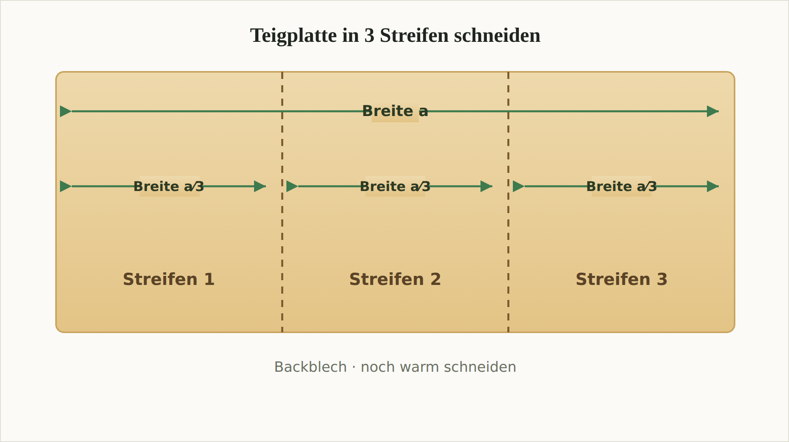
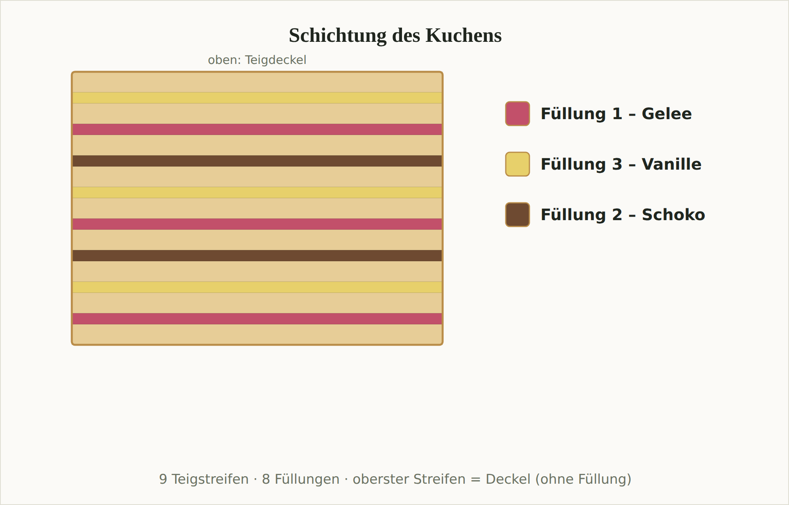

Ein geschichteter Blechkuchen aus dünnen Biskuit-Streifen mit drei Füllungen
(Johannisbeergelee, Schokolade, Vanille), über Nacht gepresst und in Form
geschnitten. Aufwendig, aber spektakulär.

## Die drei Füllungen

1. **Füllung 1 – Gelee:** Johannisbeergelee in einen größeren Behälter füllen und mit Schneebesen oder Gabel verquirlen, bis eine cremige Masse entsteht.
2. **Füllung 2 – Schoko:** Die Schoko-Kuvertüre im Wasserbad verflüssigen, dabei die Verpackung zwischendurch schütteln. Warm weiterverarbeiten.
3. **Füllung 3 – Vanille:** Soßenpulver und Zucker mit etwas Wasser glattrühren. Restliches Wasser in einem Topf erhitzen und **vor** dem Kochen die Pulver-Zucker-Mischung einrühren. Unter ständigem Rühren gut aufkochen lassen. Vom Herd nehmen, Butter und Rum-Aroma einrühren. Warm weiterverarbeiten.

## Der Teig

> **Wichtig:** Die leere Rührschüssel einmal wiegen und das Gewicht notieren.

4. Eier, Zucker, Vanillezucker und Rum-Aroma schaumig schlagen. Anschließend Mehl, Backpulver und Butter hinzufügen und alles zu einer cremigen Masse verrühren.
5. Den Teig **mit Schüssel wiegen**, um die Teigmasse gleichmäßig auf drei Backbleche aufteilen zu können:

   > Teigmasse (effektiv) = Gewicht (gesamt) − Gewicht (Schüssel) − 20 g Toleranz
   >
   > Teigmasse pro Backblech = Teigmasse (effektiv) × ⅓

## Backen & Schneiden

6. Backblech mit Backpapier auslegen bzw. gut einfetten. **⅓** der effektiven Teigmasse möglichst rechteckig darauf verteilen und bei **180 °C** Ober-/Unterhitze **10–13 Minuten** goldgelb backen.
7. Die noch warme Teigplatte in **3 gleichmäßig große Streifen** (je „Breite a ⁄ 3") schneiden. Mit den übrigen ⅔ des Teigs wiederholen — insgesamt **9 Streifen**.

> **Wichtig:** Der gebackene Teig lässt sich nur **warm** einwandfrei verarbeiten — daher direkt auf dem Blech schneiden. Nach 1–2 Minuten, wenn er etwas abgekühlt ist, löst er sich gut vom Blech. Zu kalt bricht er leicht.

## Schichten

8. Ein Backpapier auf eine möglichst glatte Fläche legen (z. B. großes Schneidebrett). Ersten Streifen darauf, dann die erste Füllung großflächig und gleichmäßig auftragen. Zweiten Streifen auflegen, zweite Füllung, dritten Streifen, dritte Füllung — usw. über alle 9 Streifen.
9. **Reihenfolge der Füllungen** (von unten nach oben, sich wiederholend): **Gelee → Vanille → Schoko**. Bei 9 Teigstreifen ergibt das **8 Füllschichten** — Gelee 3×, Vanille 3×, Schoko 2×. Die genaue Anordnung zeigt das Schaubild:

   > **Wichtig:** Die letzte (oberste) Schicht ist der **Deckel** und bleibt **ohne Füllung**. Deshalb kommen 2 Füllungen 3× und 1 Füllung 2× vor.

## Pressen

10. Ein weiteres Backpapier auf die Oberseite legen. Zum gleichmäßigen Verteilen des Gewichts eine große gerade Fläche (z. B. langes Schneidebrett) auflegen und mit **schweren Büchern** beschweren.
11. Das Gewicht **von Zeit zu Zeit erhöhen** und darauf achten, dass der Kuchen keine Schräglage bekommt. Am besten **über Nacht** pressen.
12. Danach die Ränder abschneiden — so bekommt der Kuchen seine Form. **Fertig.**

## Notizen & Varianten

- Original als gescanntes Familienrezept eingereicht (02.07.2020). Die vollständige Vorlage (4 Seiten inkl. Fotos) liegt als `anhang/streifenkuchen-scan.pdf` bei.
- Die Portionenzahl steht im Original nicht — hier grob geschätzt (großer, gepresster Blechkuchen, ~20 Stücke).
- Statt Kuvertüre geht laut Original auch fertige Schokoglasur („ein kleines Fass").
