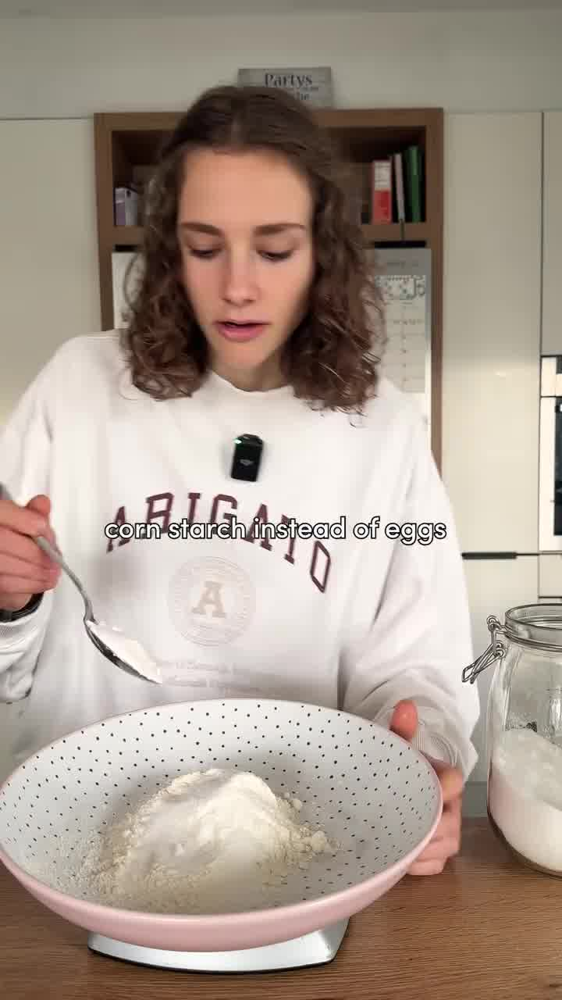
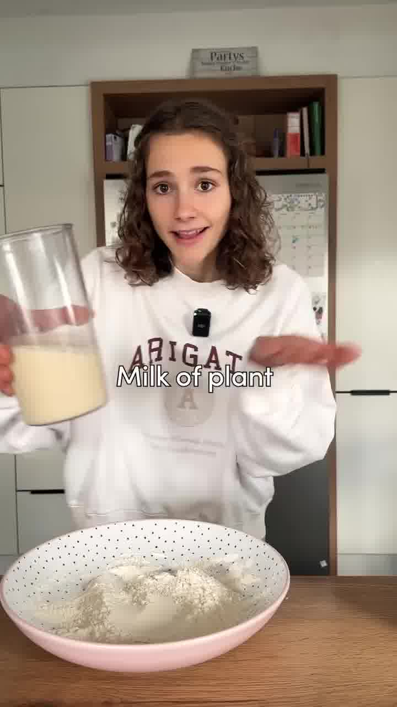
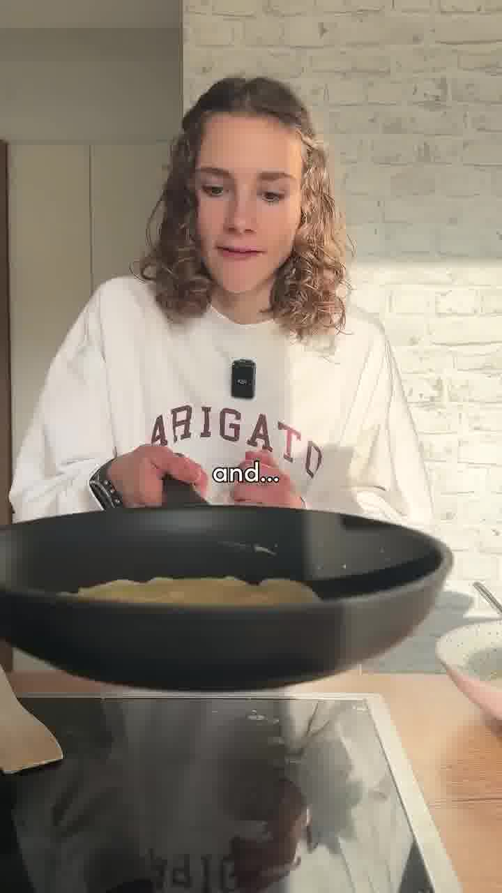
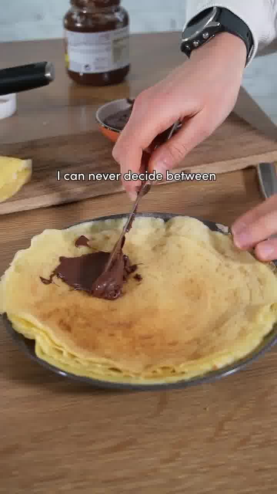

Einfaches, idiotensicheres Rezept für perfekt weiche vegane Crêpes aus nur vier Zutaten — ganz ohne Ei. Nach Belieben mit Schokoaufstrich oder Zimtzucker füllen. Ergibt 6–8 Crêpes.

## Zubereitung

1. **Teig:** Mehl, Speisestärke, Zucker und Pflanzenmilch zusammen verrühren, bis ein glatter Teig entsteht.

   

   

2. **Ausbacken:** In einer beschichteten Pfanne eine dünne Schicht Teig verteilen (durch Schwenken der Pfanne dünn verlaufen lassen). Jede Seite nur ca. **1 Minute** goldbraun braten.

   

3. **Füllen:** Warm nach Belieben füllen — z. B. mit Schokoaufstrich oder Zimtzucker — und genießen.

   

## Notizen & Varianten

- Quelle: Instagram-Reel von **Maya** (fitgreenmind) — „Easy Vegan Crêpes". Titelbild und Schritt-Fotos aus dem Video.
- Die Speisestärke ersetzt hier das Ei und macht die Crêpes weich und geschmeidig.
